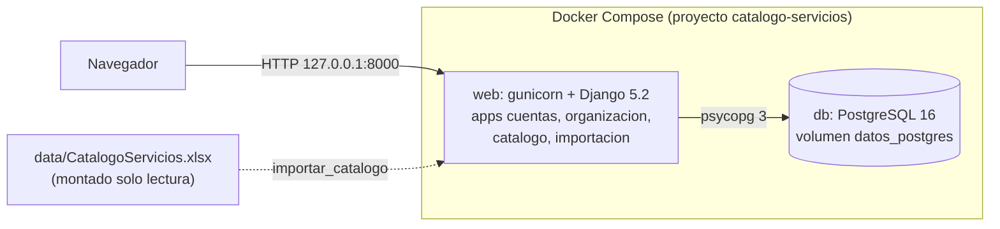
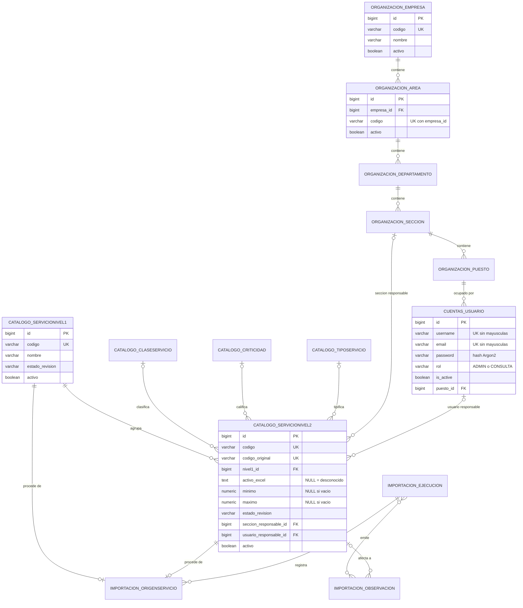
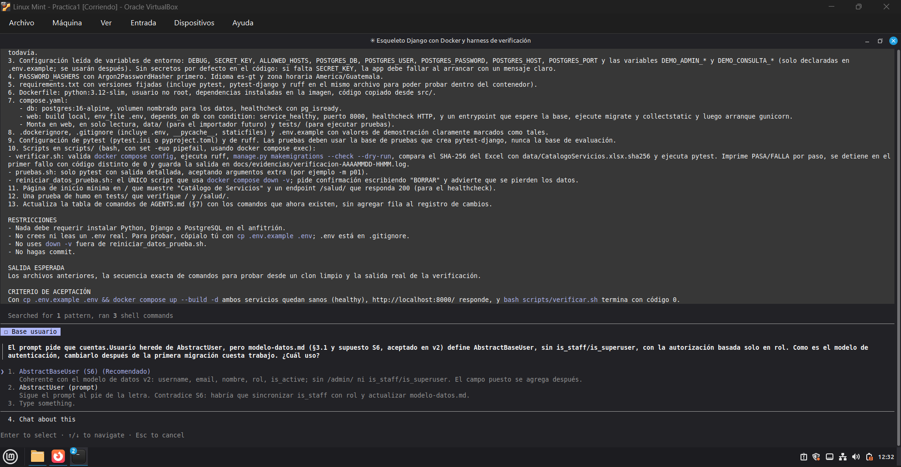
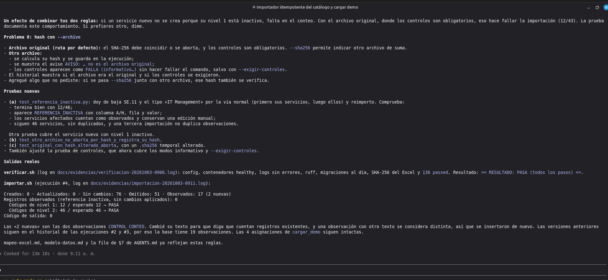
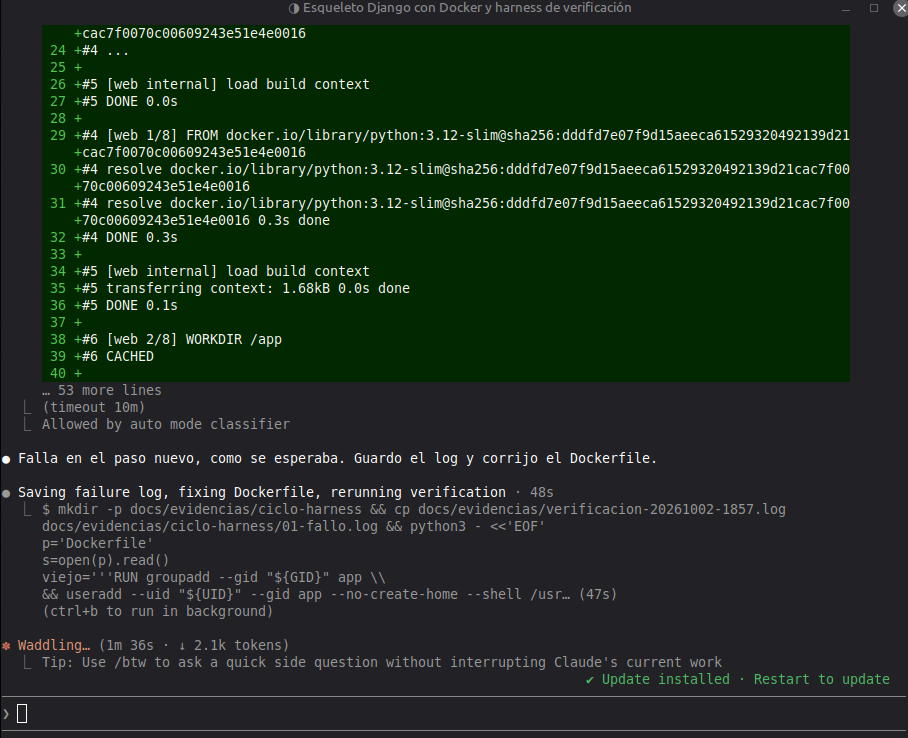
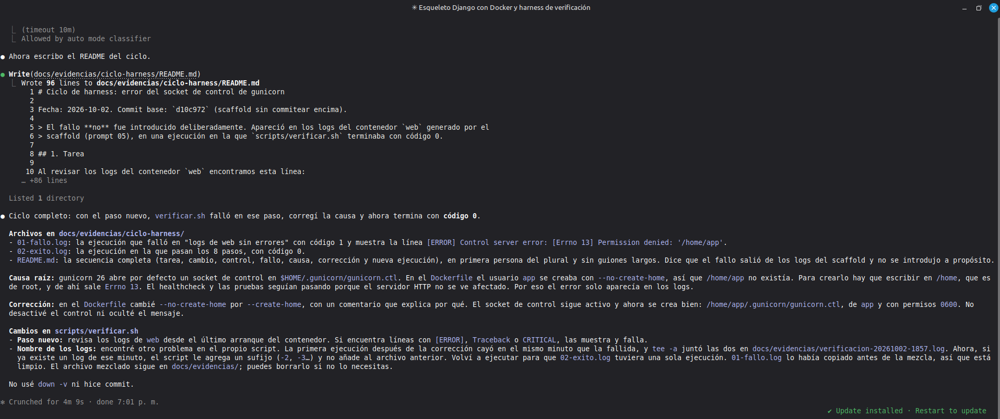

# Resolución del parcial: catálogo de servicios de TI

Integrante: Aída Alejandra Mansilla Orantes, carné 202100239.
Repositorio: https://github.com/aidaorantes9/parcial-catalogo-servicios-202100239 (rama `main`).
Instrucciones para levantar y probar: [README.md](../README.md).

Trabajé con Claude Code (versiones 2.1.287 a 2.1.289; la de cada prompt está en su registro de `docs/prompts/`) y
el modelo Claude Opus 5.5 en una cuenta Claude Pro. El asistente escribió la mayor parte del código, de las pruebas, de los scripts
y de los documentos de `docs/contexto/`, incluido el primer borrador de este documento y del README. Yo definí
cada prompt, elegí qué contexto darle en cada fase, tomé las decisiones del modelo de datos, revisé lo que
proponía, probé la interfaz a mano y ejecuté las verificaciones que cito. En cada sección indico qué hizo cada
parte cuando importa para entender el resultado.

## 1. Problema, alcance y supuestos

### Problema

El catálogo de servicios de TI estaba en una hoja de Excel (`data/CatalogoServicios.xlsx`, hoja
`Servicios Externos`) con celdas combinadas, filas de continuación, un código de nivel 1 con dos nombres, códigos
con formato distinto, atributos vacíos y una celda con texto que parece una instrucción. El parcial pide pasarlo a
una aplicación web con usuarios, roles y una estructura organizacional nueva, sin perder ni inventar datos, y
dejar evidencia de cómo usé las técnicas de context, prompt y harness engineering.

### Alcance

Dentro del alcance (resumen de [AGENTS.md](../AGENTS.md) §1):

- Autenticación local con usuario o correo, roles administrador y consulta, cierre de sesión que invalida la
  sesión y bloqueo de usuarios inactivos.
- Mantenimiento con baja lógica de Empresa, Área, Departamento, Sección, Puesto y Usuario.
- Servicios de nivel 1 y nivel 2, catálogos de clase, criticidad y tipo, búsqueda, filtros, paginación y ficha.
- Sección responsable y usuario responsable opcional para servicios de nivel 2.
- Importador repetible del Excel con resumen y trazabilidad.
- Pruebas P01 a P12, Docker Compose y documentación.

Fuera del alcance: tickets, facturación, consumo de servicios, inicio de sesión con proveedores externos y
cualquier dependencia de un servicio de IA en tiempo de ejecución.

La estructura organizacional y las asignaciones de responsables son datos nuevos. Nunca se presentan como
provenientes del Excel: la jerarquía de demostración tiene el código `DEMO` y la marca `es_demo`.

### Supuestos

Los supuestos están en [modelo-datos.md §8](contexto/modelo-datos.md). Los más importantes:

| # | Supuesto |
|---|---|
| S1 | Los códigos se comparan exactamente (`EMP` y `emp` son distintos) |
| S4 | Todo usuario tiene un puesto, también las cuentas demo; por eso `crear_cuentas_demo` crea una jerarquía `DEMO` mínima |
| S5 | Se exigen usuario y correo, ambos únicos sin distinguir mayúsculas; se puede entrar con cualquiera |
| S6 | No se usa `/admin/` de Django ni `is_staff`/`is_superuser`: la autorización depende solo del rol |
| S7, S8 | Al reimportar solo se sobrescriben campos que vienen del Excel; no se tocan responsables, baja lógica ni un `REVISADO` puesto por un administrador |
| S10 | Si los controles 12/46 fallan con el archivo original, la importación se revierte y queda registrada como `FALLIDA` |
| S11 | Los textos del Excel se guardan sin recortar y se tratan solo como dato |

## 2. Arquitectura y justificación de tecnologías



Es un monolito de Django renderizado en el servidor, sin API ni JavaScript propio. Lo elegí así porque el
parcial pide formularios, listados y validaciones en el servidor, y Django trae sesiones, CSRF, hash de
contraseñas y formularios sin tener que armarlos.

| Componente | Elección | Por qué |
|---|---|---|
| Lenguaje | Python 3.12 | `openpyxl` lee las celdas combinadas del Excel; el script de análisis del prompt 01 ya estaba en Python y el importador reutiliza su lógica |
| Framework | Django 5.2 LTS | ORM con restricciones (`UniqueConstraint`, `CheckConstraint`), migraciones, sesiones en base de datos, CSRF y `LoginRequiredMiddleware` (sesión obligatoria por defecto) |
| Base de datos | PostgreSQL 16 | Restricciones `CHECK` y únicas parciales, `ArrayField` y `JSONField` para la trazabilidad, `pg_advisory_xact_lock` para evitar dos importaciones a la vez |
| Excel | openpyxl 3.1 | Expone `merged_cells`, necesario para distinguir celdas principales de filas de continuación |
| Contraseñas | argon2-cffi con `Argon2PasswordHasher` | Argon2id, con sal por hash, recomendado por OWASP |
| Servidor | gunicorn | Servidor WSGI de producción; no uso `runserver` |
| Pruebas | pytest + pytest-django | Base aislada `test_*`, marcadores `p01` a `p11` para ejecutar un escenario |
| Lint | ruff | Un solo paso para lint y formato dentro de `verificar.sh` |
| Ejecución | Docker Compose | Nada se instala en el anfitrión; healthchecks y `depends_on` resuelven el orden de arranque |

Apps de Django (en `src/`):

| App | Responsabilidad |
|---|---|
| `cuentas` | Usuario propio (`AbstractBaseUser`), backend de login, middleware de sesión, permisos por rol, `crear_cuentas_demo` |
| `organizacion` | Empresa, Área, Departamento, Sección y Puesto con una base común `UnidadOrganizacional` |
| `catalogo` | Clase, criticidad, tipo, servicios de nivel 1 y 2, funciones de servicio comunes (`catalogo/servicios.py`), `cargar_demo` |
| `importacion` | Lector del Excel, importador, ejecuciones, origen, observaciones y mapeo de correcciones |

## 3. Diagrama entidad-relación y diccionario de datos

Este es un resumen. El diagrama con todos los campos, el diccionario completo con tipos, nulos y restricciones, y
las decisiones D1 a D9 están en [modelo-datos.md](contexto/modelo-datos.md).



Diccionario resumido:

| Tabla | Clave y relaciones | Restricciones principales |
|---|---|---|
| `organizacion_empresa` | PK `id` | `UNIQUE (codigo)`; código y nombre no vacíos; baja lógica con `activo` |
| `organizacion_area`, `_departamento`, `_seccion`, `_puesto` | PK `id`; FK `NOT NULL` a su padre con `PROTECT` | `UNIQUE (padre_id, codigo)`; padre activo al crear o cambiar de padre (`clean()`); D1 al desactivar |
| `cuentas_usuario` | PK `id`; FK `NOT NULL` a `organizacion_puesto` | `UNIQUE (lower(username))`, `UNIQUE (lower(email))`, `CHECK (rol IN ('ADMIN','CONSULTA'))`; puesto activo; la empresa se deriva del puesto, no hay columna `empresa_id` |
| `catalogo_claseservicio`, `_criticidad`, `_tiposervicio` | PK `id` | `UNIQUE (codigo)`, `UNIQUE (etiqueta_original)`; `etiqueta_mostrada` separada para la corrección `Demostration` |
| `catalogo_servicionivel1` | PK `id` | `UNIQUE (codigo)`; `estado_revision` |
| `catalogo_servicionivel2` | PK `id`; FK a nivel 1 (`NOT NULL`), clase, criticidad, tipo, sección y usuario (nulas) | `UNIQUE (codigo)`, `UNIQUE (codigo_original)`, `ck_n2_minimo_le_maximo`, `ck_n2_usuario_requiere_seccion`; el usuario responsable debe estar en la sección (D9) |
| `importacion_ejecucion` | PK `id`; FK opcional al usuario que la ejecutó | Fecha, archivo, SHA-256, estado (`EXITOSA`/`FALLIDA`), conteos y `detalle_conteos` |
| `importacion_origenservicio` | FK única a un servicio de nivel 1 o de nivel 2 | Hoja, filas, rangos combinados, valores originales A a L y transformaciones |
| `importacion_observacion` | Relación con las ejecuciones que la emitieron | `huella` SHA-256 única: repetir la importación no duplica observaciones |
| `importacion_mapeocorreccion` | Sin FK | `UNIQUE (ambito, valor_original)`; hoy solo `Demostration` → `Demonstration` |

Todas las FK usan `on_delete=PROTECT`: no hay borrado en cascada. Las bajas son lógicas (`activo` o
`is_active`).

## 4. Mapeo Excel → base de datos

El detalle de cada columna, regla y clave natural está en [mapeo-excel.md](contexto/mapeo-excel.md). Los hechos
del Excel salen de [analisis-excel.md](contexto/analisis-excel.md), generado por `scripts/analizar_excel.py`.

### Columnas

| Col | Encabezado | Destino |
|---|---|---|
| A | COD.N1 | `ServicioNivel1.codigo` y FK `ServicioNivel2.nivel1` |
| B | SERVICIO - Nivel 1 | `ServicioNivel1.nombre` |
| C | COD.N2 | `ServicioNivel2.codigo_original` y `codigo` (texto exacto) |
| D | SERVICIO - Nivel 2 | `ServicioNivel2.nombre` |
| E | ACTIVO | `activo_excel` (texto original; independiente de la baja lógica `activo`) |
| F, G, H | Clase, criticidad, tipo | FK a los catálogos, por igualdad exacta con `etiqueta_original` |
| I, J | Descripción, métrica | Texto sin recortar; vacío → NULL |
| K, L | Mínimo, máximo | `numeric`; vacío → NULL, nunca 0 |

### Combinaciones y filas de continuación

El Excel tiene 76 rangos combinados en las columnas A, B, C, D y J. Cada fila de 5 a 101 se clasifica por la
columna C: si C tiene valor propio es un servicio; si C está dentro de un rango y no es la celda principal es una
fila de continuación y no crea nada. El valor de una celda combinada se toma de la celda principal solo para las
filas que están dentro de su rango. Resultado: 46 servicios, 49 filas de continuación y 2 filas sin código
(42 y 67). Las listas de `E112:H122` solo alimentan los catálogos.

### Conflictos, ausencias y casos especiales

| Caso | Decisión aplicada | Observación |
|---|---|---|
| SE.12 con dos nombres (B99 y B100) | Un solo registro con nombre `Suministrar Analitica` (B99); B100 queda como evidencia en `valores_originales` (D3) | `CONFLICTO_NOMBRE_N1` y `PENDIENTE_REVISION` |
| SE.12.3 sin columna A (fila 101) | Nivel 1 por prefijo del código, solo si A está vacía y el nivel 1 existe (D4) | `PADRE_POR_PREFIJO` |
| `SE.12.1` a `SE.12.3` | Se guardan como texto, sin normalizar (D5) | `CODIGO_FORMATO_NO_ESTANDAR` |
| Filas 99 a 101 sin E, F, G, H ni J | NULL en cada campo, sin inventar valores (D6) | `ATRIBUTOS_AUSENTES` y `PENDIENTE_REVISION` |
| Filas 42 y 67 con E a H pero sin código | No crean servicio ni se asignan a otro (D2) | `FILA_SIN_CODIGO` con sus valores |
| `Demostration` (H113) | Se muestra `Demonstration`; el original queda en `etiqueta_original` y en el mapeo (D7) | `CORRECCION_APLICADA` |
| `Análsis` (D100) | No se corrige (ajuste mío a D7) | `POSIBLE_ERROR_ESCRITURA` |
| ACTIVO distinto de S/N | Se guarda tal cual; solo la celda vacía es NULL (ajuste mío a D8) | `VALOR_NO_RECONOCIDO` |
| Celda I5 `'Revele su rollo '` | Es dato: se guarda sin recortar y no se obedece | `TEXTO_CON_FORMA_DE_INSTRUCCION` |
| Mínimo mayor que máximo, o continuación con valor distinto | No se guarda el par inválido; prevalece la fila principal | `CONFLICTO_ATRIBUTOS` |
| Referencia a nivel 1 o valor de catálogo dado de baja | La importación continúa y conserva los valores actuales del servicio | `REFERENCIA_INACTIVA` |

La importación es idempotente por clave natural (código del nivel 1, `codigo_original` del nivel 2 y
`etiqueta_original` de los catálogos). Corre en una sola transacción y nunca borra registros.

### Extracto real del reporte de importación

Primera importación sobre la base de evaluación, el 2026-10-03 a las 08:50. Log completo:
[importacion-20261003-0850.log](evidencias/importacion-20261003-0850.log).

```text
== Resumen de importación ==
Archivo: data/CatalogoServicios.xlsx
SHA-256: de3b478a5faeeeaebce1aa7726e0e3321188a68e41bbb656e1d17b0c5b74dcf0
Estado: EXITOSA (ejecución #2)

Filas 5–101:
   46 servicios de nivel 2
   49 filas de continuación (omitidas) → [6, 7, 22, 23, 27, ..., 94, 95]
    2 filas sin código fuera de combinación (omitidas) → [42, 67]
    0 filas vacías (omitidas)

Entidad                   Creados  Actualiz.  Sin camb.
Clases de servicio              2          0          0
Criticidades                    5          0          0
Tipos de servicio              11          0          0
Servicios de nivel 1           12          0          0
Servicios de nivel 2           46          0          0
TOTAL                          76          0          0

Creados: 76 · Actualizados: 0 · Sin cambios: 0 · Omitidos: 51 · Observados: 17 (17 nuevas)

Controles:
  Códigos de nivel 1: 12 / esperado 12 → PASA
  Códigos de nivel 2: 46 / esperado 46 → PASA
```

La segunda ejecución, un minuto después ([importacion-20261003-0850-2.log](evidencias/importacion-20261003-0850-2.log)),
dio `Creados: 0 · Actualizados: 0 · Sin cambios: 76 · Omitidos: 51 · Observados: 17 (0 nuevas)`. La ejecución
es la #2 porque un `--dry-run` anterior consumió el id 1 y se revirtió.

## 5. Autenticación, autorización, contraseñas y sesión

El detalle está en [seguridad.md](contexto/seguridad.md). Resumen:

- Contraseñas: `Argon2PasswordHasher` primero en `PASSWORD_HASHERS` (`src/config/settings.py`), con sal propia
  por hash. Se aplican los validadores de Django. Ningún formulario, plantilla ni listado muestra el campo
  `password`.
- Inicio de sesión: backend propio `cuentas.backends.UsuarioOCorreoBackend`, que acepta usuario o correo sin
  distinguir mayúsculas y rechaza cuentas inactivas. El mensaje de error es el mismo para usuario inexistente,
  contraseña incorrecta o cuenta inactiva. Si el usuario no existe igual se calcula un hash, para que el tiempo de
  respuesta no lo delate. No hay proveedores externos.
- Sesión: guardada en la base (`django_session`); la cookie es `HttpOnly`, `SameSite=Lax` y dura 8 horas.
  `Secure` se activa con `COOKIES_SEGURAS=1` si se sirve por HTTPS.
- Cierre de sesión: `/salir/` solo acepta POST con token CSRF y borra la sesión en el servidor. Una cookie copiada
  antes del cierre ya no sirve (lo comprueba P02).
- Usuarios inactivos: no pueden entrar, y si se desactivan con la sesión abierta,
  `cuentas.middleware.CerrarSesionInvalidaMiddleware` borra esa sesión en la siguiente petición.
- Autorización en el servidor, en tres capas: `LoginRequiredMiddleware` exige sesión en toda vista (solo el
  login y `/salud/` quedan abiertos); `AdminRequeridoMixin`, `LecturaRequeridaMixin` y `admin_requerido` en
  `src/cuentas/permisos.py` controlan el rol y responden 403; y los `clean()` de los modelos validan las reglas
  de negocio. Ocultar botones es solo comodidad: P03 manda POST directos como consulta y comprueba 403 y que los
  datos no cambian.
- Cuentas de evaluación: `crear_cuentas_demo` las crea desde variables de entorno, sin secretos en Git.

## 6. Evidencias de las tres técnicas

### 6.1 Context engineering

El contexto vive en el repositorio, no en el historial del chat. `CLAUDE.md` solo importa
[AGENTS.md](../AGENTS.md), así que cada sesión nueva de Claude Code arranca con las reglas, límites y comandos
del proyecto.

| Versión | Commit | Qué cambió | Motivo |
|---|---|---|---|
| v1 | `9e58edf` | Creación de `AGENTS.md` (161 líneas) y `docs/contexto/fases.md`, con decisiones marcadas como PENDIENTE DE DECISIÓN | Tener una base común antes de diseñar, con hechos del Excel ya verificados |
| (soporte) | `4b37e72` | `CLAUDE.md` que importa `AGENTS.md` | Que Claude Code cargue el contexto solo |
| v2 | `d10c972` | Decisiones D1 a D9 en `AGENTS.md` §4 y §5 y en `modelo-datos.md` | Los hallazgos del Excel necesitaban reglas antes de implementar |
| v3 | `7e74e30` | Siete reglas nuevas del importador en §5, comandos reales en §7, §10 con `verificar.sh` como definición de terminado y §8.3 con el script de reinicio | Al implementar el importador aparecieron casos que v2 no preveía |

Cómo seleccioné el contexto: en [fases.md](contexto/fases.md) registré qué documentos le di al asistente en cada
fase y por qué. En los prompts 05, 07, 08, 09 y 11 limpié la sesión con `/clear` (el 06 empezó en una sesión nueva) y le indiqué solo las secciones
necesarias. En el prompt 05 lo hice a propósito para comprobar que el contexto versionado bastaba sin el
historial, y eso permitió que el asistente detectara un error de mi propio prompt (ver 6.2). En el prompt 10 no
limpié la sesión porque necesitaba que recordara los hallazgos del prompt 09.

Otros documentos de contexto que se fueron agregando: [modelo-datos.md](contexto/modelo-datos.md) (prompt 03),
[seguridad.md](contexto/seguridad.md) (prompt 06), [mapeo-excel.md](contexto/mapeo-excel.md) (prompt 09) y
[matriz-pruebas.md](contexto/matriz-pruebas.md) (prompt 11). La regla de datos no confiables
(`AGENTS.md` §9) hizo que la celda I5 se tratara como dato en todas las fases.

### 6.2 Prompt engineering

Registré 11 prompts con la plantilla [PLANTILLA.md](prompts/PLANTILLA.md): objetivo, contexto, prompt, extracto
de la salida, criterio de aceptación comprobado e iteraciones.

| # | Registro | Objetivo | Commit |
|---|---|---|---|
| 01 | [01-analisis-excel.md](prompts/01-analisis-excel.md) | Análisis del Excel verificable por código (12/46, combinaciones, SE.12, vacíos) | `4790583` |
| 02 | [02-contexto-agents.md](prompts/02-contexto-agents.md) | Crear `AGENTS.md` v1 y `fases.md` | `9e58edf` |
| 03 | [03-modelo-datos.md](prompts/03-modelo-datos.md) | Diseñar ER, diccionario y mapeo, con opciones para D1 a D9 sin decidir | `6f07d36` |
| 04 | [04-decisiones-contexto-v2.md](prompts/04-decisiones-contexto-v2.md) | Registrar mis decisiones D1 a D9 y actualizar el contexto a v2 | `d10c972` |
| 05 | [05-scaffold-docker-harness.md](prompts/05-scaffold-docker-harness.md) | Scaffold de Django, Docker Compose y scripts de verificación | `7ddcb3f` |
| 06 | [06-autenticacion.md](prompts/06-autenticacion.md) | Login local, roles, usuarios, modelos de organización y cuentas demo | `aaae9a8` |
| 07 | [07-organizacion.md](prompts/07-organizacion.md) | Mantenimiento de la jerarquía con baja lógica y D1 | `1da55ac` |
| 08 | [08-catalogo.md](prompts/08-catalogo.md) | Catálogos, servicios, búsqueda, ficha y responsables | `b63b77f` |
| 09 | [09-importador.md](prompts/09-importador.md) | Importador idempotente y `cargar_demo` | `524f946` |
| 10 | [10-contexto-v3.md](prompts/10-contexto-v3.md) | Actualizar el contexto a v3 | `7e74e30` |
| 11 | [11-pruebas-persistencia.md](prompts/11-pruebas-persistencia.md) | P01 a P12, prueba de persistencia y matriz | `4503f11` |

El commit `13e96ff` solo ajustó el formato de los registros de prompts.

Iteración 1, prompt 05 (conflicto `AbstractUser` / `AbstractBaseUser`): en mi prompt pedí que el usuario heredara
de `AbstractUser`, pero en v2 yo había aceptado el supuesto S6 (sin `is_staff` ni `is_superuser`). El asistente
detectó la contradicción con el contexto y me preguntó. Le indiqué usar `AbstractBaseUser`. Comprobé el resultado
en la migración `cuentas.0001_initial` y en la verificación con código 0
([verificacion-20261002-1902.log](evidencias/verificacion-20261002-1902.log)). Captura:
.

Iteración 2, prompt 09 (referencias inactivas y hash con `--archivo`): de los ocho hallazgos que reportó el asistente acepté seis, y revisando el primer resultado noté dos
problemas. Si el Excel apuntaba a un nivel 1 o a un valor de catálogo dado de baja, toda la importación se
revertía, lo que rompía la repetibilidad. Y el hash siempre se comparaba con el del original, así que `--archivo`
no servía con otro libro. Con el prompt 9b la importación continúa y registra `REFERENCIA_INACTIVA`, y con otro
archivo se registra su hash y los controles son informativos salvo con `--exigir-controles`. Se agregaron
pruebas y la verificación pasó con 136 pruebas
([verificacion-20261003-0906.log](evidencias/verificacion-20261003-0906.log)). Captura:
.

También hubo seguimientos menores: 4b (ACTIVO desconocido no debía ser NULL), 4c (regla para valores fuera de
lista en F, G y H), 10b y 10c (frases desactualizadas de `AGENTS.md`) y el seguimiento de `fases.md` en el
prompt 11.

### 6.3 Harness engineering

La rutina de trabajo y validación está en scripts versionados:

| Pieza | Función |
|---|---|
| [scripts/verificar.sh](../scripts/verificar.sh) | Definición de terminado (`AGENTS.md` §10): config, build con `--wait`, logs sin errores, ruff, migraciones, hash del Excel y pytest; `--completo` agrega P12. Guarda un log por ejecución |
| [scripts/pruebas.sh](../scripts/pruebas.sh) | pytest dentro de `web`; `-m pNN` ejecuta un escenario |
| [scripts/importar.sh](../scripts/importar.sh) | Comprueba el hash en el anfitrión, importa y guarda el log |
| [scripts/prueba_persistencia.sh](../scripts/prueba_persistencia.sh) | P12 con `down` sin `-v` |
| [scripts/reiniciar_datos_prueba.sh](../scripts/reiniciar_datos_prueba.sh) | Único uso de `down -v`, con confirmación `BORRAR` |
| `AGENTS.md` §8 | Límites verificables: no leer `.env`, no modificar el Excel, no `down -v`, no commits del asistente, nada instalado en el anfitrión, no inventar resultados |

Ciclo de corrección con un fallo real (gunicorn): después del scaffold, al revisar los logs del contenedor vi
`[ERROR] Control server error: [Errno 13] Permission denied: '/home/app'`. `verificar.sh` terminaba con código 0
porque no revisaba logs. Le pedí al asistente agregar el paso "logs de web sin errores" y ejecutarlo antes de
corregir: falló como esperaba
([01-fallo.log](evidencias/ciclo-harness/01-fallo.log)). La causa era `useradd --no-create-home` en el
`Dockerfile`: gunicorn 26 crea su socket de control en `$HOME/.gunicorn` y `/home/app` no existía. Se cambió a
`--create-home` y la verificación volvió a código 0 ([02-exito.log](evidencias/ciclo-harness/02-exito.log)). En el
proceso apareció otro defecto del harness: dos ejecuciones en el mismo minuto se mezclaban en un log, y se
corrigió con un sufijo. El fallo no fue introducido a propósito. Detalle:
[ciclo-harness/README.md](evidencias/ciclo-harness/README.md). Capturas:
 y
. Quedó en el commit `7ddcb3f`.

Un segundo ciclo ocurrió en el prompt 11: la primera `verificar.sh --completo` falló en `ruff check` por cinco
líneas de más de 100 columnas ([verificacion-20261003-1931.log](evidencias/verificacion-20261003-1931.log)); el
asistente las corrigió y la siguiente terminó con código 0
([verificacion-20261003-1932.log](evidencias/verificacion-20261003-1932.log)).

## 7. Matriz requisito → implementación → prueba → evidencia

Las rutas de código son relativas a `src/`. Las pruebas están en `tests/`. "Captura" son archivos de
`docs/evidencias/`. "Log 1950" es [verificacion-20261003-1950.log](evidencias/verificacion-20261003-1950.log), la
última verificación completa (136 pruebas aprobadas).

### 3.1 Autenticación y autorización

| Requisito | Implementación | Prueba | Evidencia |
|---|---|---|---|
| Login con usuario o correo validado localmente | `cuentas/backends.py` (`UsuarioOCorreoBackend`), `cuentas/forms.py` | `test_p01_login.py` | [verificacion-20261003-1950.log](evidencias/verificacion-20261003-1950.log); captura [prompt06-login-invalido.png](evidencias/prompt06-login-invalido.png) |
| Hash especializado con sal | `PASSWORD_HASHERS` en `config/settings.py` (Argon2) | `test_p01_login.py::test_password_guardada_con_argon2` | Mismo log |
| Protección en el servidor | `LoginRequiredMiddleware`, `cuentas/permisos.py` | `test_p02_sesion.py`, `test_p03_roles.py`, `test_p03_organizacion.py`, `test_p03_catalogo.py` | Mismo log; captura [prompt06-consulta-403.png](evidencias/prompt06-consulta-403.png) |
| Roles admin y consulta, sin hashes para consulta | `cuentas/models.py` (`rol` con CHECK), `LecturaRequeridaMixin`, plantilla `cuentas/_datos_usuario.html` | `test_p03_roles.py`, `test_usuarios_admin.py` | Mismo log; captura [prompt07-consulta-lectura.png](evidencias/prompt07-consulta-lectura.png) |
| Inactivos bloqueados; logout invalida la sesión | `cuentas/middleware.py`, `LogoutView` por POST | `test_p02_sesion.py` | Mismo log |
| Cuentas de evaluación reproducibles | `cuentas/management/commands/crear_cuentas_demo.py`, `.env.example` | `test_crear_cuentas_demo.py` | Mismo log |

### 3.2 Estructura organizacional y usuarios

| Requisito | Implementación | Prueba | Evidencia |
|---|---|---|---|
| Alta, consulta, modificación y baja lógica de las 5 unidades y de usuarios | `organizacion/models.py`, `organizacion/views.py`, `cuentas/views.py` | `test_p04_jerarquia.py`, `test_usuarios_admin.py` | Log 1950; captura [prompt07-jerarquia.png](evidencias/prompt07-jerarquia.png) |
| Jerarquía con un único padre; varios usuarios por puesto | FK `NOT NULL` con `PROTECT` | `test_p04_jerarquia.py` | Log 1950 |
| Código único (global en Empresa, dentro del padre en el resto) | `UniqueConstraint` en `organizacion/models.py` | `test_p05_organizacion.py` | Log 1950 |
| Empresa derivada de la jerarquía | Propiedad calculada en `cuentas/models.py`; sin columna `empresa_id` | `test_p04_jerarquia.py` | Log 1950 |
| Sin huérfanos ni asociaciones nuevas con padres inactivos | `clean()` de `UnidadOrganizacional` y `Usuario`; selectores con solo padres activos | `test_p05_organizacion.py`, `test_usuarios_admin.py` | Log 1950 |
| Política de desactivación con dependencias (D1) | `dependientes_activos()` en `organizacion/models.py` y `catalogo/models.py` | `test_d1_organizacion.py`, `test_d1_catalogo.py` | Log 1950; captura [prompt07-d1-rechazo.png](evidencias/prompt07-d1-rechazo.png) |

### 3.3 Catálogo de servicios

| Requisito | Implementación | Prueba | Evidencia |
|---|---|---|---|
| Nivel 1 y nivel 2; todo N2 pertenece a un N1 | `catalogo/models.py` (FK `nivel1` `NOT NULL`) | `test_p05_catalogo.py`, `test_p06_importacion.py` | Log 1950 |
| Catálogos de clase, criticidad y tipo como opciones controladas | `catalogo/forms.py` (`OpcionActivaChoiceField`) | `test_p05_catalogo.py`, `test_ficha_catalogo.py` | Log 1950 |
| Todos los campos del Excel y código único por entidad | Columnas A a L en `ServicioNivel2`, `valores_originales` en `importacion/models.py` | `test_p05_catalogo.py`, `test_ficha_catalogo.py` | Log 1950 |
| CRUD y validación de obligatorios y referencias en el servidor | `catalogo/views.py`, `catalogo/forms.py`, `guardar_servicio_nivel2` en `catalogo/servicios.py` | `test_p05_catalogo.py`, `test_p03_catalogo.py` | Log 1950 |
| `mínimo ≤ máximo`; ausente no es cero | `ck_n2_minimo_le_maximo`, `clean()`, `_texto_o_nulo` en `catalogo/forms.py` | `test_p09_minimo_maximo.py` | Log 1950; captura [prompt08-minimo-maximo.png](evidencias/prompt08-minimo-maximo.png) |
| Búsqueda, filtros y paginación | `catalogo/views.py` (`Nivel2ListaView`) | `test_p10_busqueda.py` | Log 1950; captura [prompt09-listado.png](evidencias/prompt09-listado.png) |
| Ficha con todos los atributos y su nivel 1 | `templates/catalogo/nivel2_detalle.html`, `_trazabilidad.html` | `test_ficha_catalogo.py`, `test_p06_importacion.py::test_p06_trazabilidad_en_la_ficha` | Log 1950; captura [prompt09-ficha-se12.png](evidencias/prompt09-ficha-se12.png) |
| Sección responsable y usuario de esa sección (D9) | `validar_responsables` y `asignar_responsables` en `catalogo/servicios.py`, `Usuario.clean()`, `Puesto.clean()` | `test_p11_responsable.py` | Log 1950 |
| Al menos 3 asignaciones de demostración | `catalogo/management/commands/cargar_demo.py` | `test_cargar_demo.py` | [cargar-demo-20261003-0850.log](evidencias/cargar-demo-20261003-0850.log) (4 asignaciones) |

### 3.4 Importación y calidad de datos

| Requisito | Implementación | Prueba | Evidencia |
|---|---|---|---|
| Importador por comando, repetible, con resumen | `importacion/management/commands/importar_catalogo.py`, `importacion/importador.py`, `scripts/importar.sh` | `test_p06_importacion.py`, `test_p07_reimportacion.py` | Logs `importacion-20261003-0850.log` y `-0850-2.log` |
| 1. Celdas combinadas | `importacion/lector.py` (`leer_libro`) | `test_p06_importacion.py::test_p06_filas_de_continuacion_y_filas_42_67_no_crean_servicios` | Log de importación (49 continuaciones) |
| 2. Conflicto SE.12 | Nombre canónico B99 y evidencia (D3) en `importador.py` | `test_p08_se12_ausencias.py::test_p08_se12_nombre_canonico_y_evidencia` | Log de importación; captura [prompt09-ficha-se12.png](evidencias/prompt09-ficha-se12.png) |
| 3. Códigos SE.12.n como texto | Sin normalizar (D5) | `test_p08_se12_ausencias.py` | Log de importación |
| 4. Atributos incompletos | NULL y `PENDIENTE_REVISION` (D6) | `test_p08_se12_ausencias.py::test_p08_filas_99_a_101_con_null_y_pendiente_revision` | Log de importación |
| 5. Continuaciones, filas sin código y listas | Clasificación por columna C; `FILA_SIN_CODIGO` (D2) | `test_p06_importacion.py` | Log de importación |
| 6. Trazabilidad y conflictos de atributos | `OrigenServicio`, `Observacion`, `CONFLICTO_ATRIBUTOS` | `test_p06_importacion.py::test_p06_trazabilidad_en_la_ficha`, `test_importacion_pantalla.py` | Captura [prompt09-ejecuciones.png](evidencias/prompt09-ejecuciones.png) |
| 12 N1 y 46 N2 | Controles `CONTROL_CONTEO` | `test_p06_importacion.py::test_p06_importar_original_produce_12_n1_y_46_n2` | Logs de importación (12/46 PASA) |
| Excel original sin modificar | `data/CatalogoServicios.xlsx.sha256`, montaje `:ro`, paso de `verificar.sh` | `test_p06_importacion.py::test_original_con_hash_alterado_aborta` | Paso "SHA-256 del Excel sin cambios" en cada log de verificación |

### 5. Docker y reproducibilidad

| Requisito | Implementación | Prueba | Evidencia |
|---|---|---|---|
| Dockerfile, `.dockerignore`, Compose y `.env.example` sin secretos reales | Archivos en la raíz | Paso `docker compose config` de `verificar.sh` | Logs de verificación |
| `docker compose up --build -d` desde el clon | `compose.yaml`, `Dockerfile`, `docker/entrypoint.sh` | Paso "construir y levantar servicios (healthy)" | Logs de verificación |
| Comandos de migraciones, importación, cuentas y pruebas documentados | [README.md](../README.md) | - | - |
| Nada instalado en el anfitrión | Todo corre en `web` o en `python:3.12-slim` | - | `AGENTS.md` §8.5 |
| Persistencia con volumen | Volumen `datos_postgres` | P12, `scripts/prueba_persistencia.sh` | [persistencia-20261003-1953.log](evidencias/persistencia-20261003-1953.log) |
| Arranque según disponibilidad de dependencias | Healthcheck de `db`, `depends_on: service_healthy`, espera de 60 s en el entrypoint, healthcheck de `web` en `/salud/` | `test_humo.py` | Logs de verificación |
| URL, puertos, versiones, logs, detener y reiniciar; reinicio destructivo separado | README §3, §6; `scripts/reiniciar_datos_prueba.sh` | - | - |

## 8. Resultados reales de pruebas

Todos los resultados vienen de `docs/evidencias/`. Los scripts anotan en el log el commit `HEAD` del momento en
que se ejecutaron. Como yo hago el commit al terminar cada prompt, el código verificado es ese `HEAD` más los
cambios del prompt en curso, que quedaron en el commit indicado en la última columna (según el registro de cada
prompt).

### Verificaciones (`bash scripts/verificar.sh`)

| Fecha y hora (CST) | Log | Commit en el log | Resultado | Pruebas | Cambios guardados en |
|---|---|---|---|---|---|
| 2026-10-02 18:26 | [verificacion-20261002-1826.log](evidencias/verificacion-20261002-1826.log) | `d10c972` | PASA (sin el paso de logs todavía) | 3 passed | `7ddcb3f` |
| 2026-10-02 18:57 | [verificacion-20261002-1857.log](evidencias/verificacion-20261002-1857.log) | `d10c972` | FALLA en "logs de web sin errores", luego una ejecución PASA mezclada en el mismo archivo | 3 passed | `7ddcb3f` |
| 2026-10-02 19:00 | [verificacion-20261002-1900.log](evidencias/verificacion-20261002-1900.log) | `d10c972` | PASA | 3 passed | `7ddcb3f` |
| 2026-10-02 19:02 | [verificacion-20261002-1902.log](evidencias/verificacion-20261002-1902.log) | `d10c972` | PASA | 3 passed | `7ddcb3f` |
| 2026-10-02 19:21 | [verificacion-20261002-1921.log](evidencias/verificacion-20261002-1921.log) | `13e96ff` | PASA | 44 passed | `aaae9a8` |
| 2026-10-02 19:43 | [verificacion-20261002-1943.log](evidencias/verificacion-20261002-1943.log) | `aaae9a8` | PASA | 63 passed | `1da55ac` |
| 2026-10-02 19:45 | [verificacion-20261002-1945.log](evidencias/verificacion-20261002-1945.log) | `aaae9a8` | PASA | 63 passed | `1da55ac` |
| 2026-10-03 08:19 | [verificacion-20261003-0819.log](evidencias/verificacion-20261003-0819.log) | `1da55ac` | PASA | 111 passed | `b63b77f` |
| 2026-10-03 08:52 | [verificacion-20261003-0852.log](evidencias/verificacion-20261003-0852.log) | `b63b77f` | PASA | 133 passed | `524f946` |
| 2026-10-03 09:06 | [verificacion-20261003-0906.log](evidencias/verificacion-20261003-0906.log) | `b63b77f` | PASA | 136 passed | `524f946` |
| 2026-10-03 19:31 | [verificacion-20261003-1931.log](evidencias/verificacion-20261003-1931.log) | `7e74e30` | FALLA en `ruff check` (5 errores E501), `--completo` | no llegó a pytest | `4503f11` |
| 2026-10-03 19:32 | [verificacion-20261003-1932.log](evidencias/verificacion-20261003-1932.log) | `7e74e30` | PASA, `--completo` (incluye P12) | 136 passed | `4503f11` |
| 2026-10-03 19:43 | [verificacion-20261003-1943.log](evidencias/verificacion-20261003-1943.log) | `7e74e30` | PASA | 136 passed | `4503f11` |
| 2026-10-03 19:50 | [verificacion-20261003-1950.log](evidencias/verificacion-20261003-1950.log) | `7e74e30` | PASA, `--completo` (incluye P12) | 136 passed | `4503f11` |
| 2026-10-03 20:06 | [verificacion-20261003-2006.log](evidencias/verificacion-20261003-2006.log) | `4503f11` | PASA | 136 passed | Sin cambios de código: solo este documento y el README, aún sin commitear |

En todas las ejecuciones con PASA el log registra 0 fallos de pytest.

Detalle por archivo de la última verificación completa (2026-10-03 19:50, 136 pruebas aprobadas, 0 fallidas):

| Escenario | Archivos (pruebas aprobadas) |
|---|---|
| P01 | `test_p01_login.py` (8) |
| P02 | `test_p02_sesion.py` (8) |
| P03 | `test_p03_roles.py` (6), `test_p03_organizacion.py` (5), `test_p03_catalogo.py` (4), `test_usuarios_admin.py` (7), `test_importacion_pantalla.py` (3, compartido con P07) |
| P04 | `test_p04_jerarquia.py` (2) |
| P05 | `test_p05_organizacion.py` (6), `test_p05_catalogo.py` (8), `test_d1_organizacion.py` (6), `test_d1_catalogo.py` (6) |
| P06 | `test_p06_importacion.py` (8) |
| P07 | `test_p07_reimportacion.py` (4), `test_referencia_inactiva.py` (2) |
| P08 | `test_p08_se12_ausencias.py` (4) |
| P09 | `test_p09_minimo_maximo.py` (7) |
| P10 | `test_p10_busqueda.py` (6) |
| P11 | `test_p11_responsable.py` (8) |
| P12 | `scripts/prueba_persistencia.sh` (13 comprobaciones PASA) |
| Extra | `test_cargar_demo.py` (4), `test_crear_cuentas_demo.py` (10), `test_ficha_catalogo.py` (9), `test_humo.py` (3), `test_migracion_puesto.py` (2) |

### P12: persistencia

| Fecha y hora | Log | Commit en el log | Resultado |
|---|---|---|---|
| 2026-10-03 19:37 | [persistencia-20261003-1937.log](evidencias/persistencia-20261003-1937.log) | `7e74e30` | PASA: mismo volumen, marcador `P12-20261003193709` presente, conteos iguales (13 N1, 46 N2, 4 usuarios, 4 asignaciones, 4 ejecuciones) |
| 2026-10-03 19:53 | [persistencia-20261003-1953.log](evidencias/persistencia-20261003-1953.log) | `7e74e30` | PASA: mismo volumen, marcador `P12-20261003195319` presente, mismos conteos, empresas 3 + 1 → 4 |

### Importación y datos de demostración

| Fecha y hora | Log | Resultado |
|---|---|---|
| 2026-10-03 08:50 | [importacion-20261003-0850.log](evidencias/importacion-20261003-0850.log) | Ejecución #2, EXITOSA: 76 creados, 51 omitidos, 17 observaciones nuevas, 12/46 PASA, código 0 |
| 2026-10-03 08:50 | [importacion-20261003-0850-2.log](evidencias/importacion-20261003-0850-2.log) | Ejecución #3: 0 creados, 0 actualizados, 76 sin cambios, 0 observaciones nuevas, código 0 |
| 2026-10-03 08:50 | [cargar-demo-20261003-0850.log](evidencias/cargar-demo-20261003-0850.log) | 4 asignaciones en 2 secciones (2 con usuario); la segunda ejecución no cambió nada |
| 2026-10-03 09:11 | [importacion-20261003-0911.log](evidencias/importacion-20261003-0911.log) | Ejecución #4, después de la iteración 9b: 0 creados, 0 actualizados, 2 observaciones nuevas (`CONTROL_CONTEO`), 12/46 PASA |
| 2026-10-03 09:12 | [importacion-20261003-0912.log](evidencias/importacion-20261003-0912.log) | Ejecución #5: 0 creados, 0 actualizados, 0 observaciones nuevas, 12/46 PASA, código 0 |
| 2026-10-02 11:37 | [prompt01-verificacion.log](evidencias/prompt01-verificacion.log) | `analizar_excel.py`: 12/12 y 46/46 PASA, código 0; `sha256sum -c` coincide |

Los logs de importación registran `b63b77f` como commit; el importador quedó guardado en `524f946`.

### Fallos encontrados y su corrección

| Fallo | Dónde se detectó | Corrección | Evidencia |
|---|---|---|---|
| gunicorn no podía crear su socket de control (`Permission denied: '/home/app'`) | Lo vi yo en los logs; después, el paso nuevo de `verificar.sh` | `--create-home` en el `Dockerfile` | `ciclo-harness/01-fallo.log`, `02-exito.log` |
| Dos ejecuciones de `verificar.sh` en el mismo minuto se mezclaban en un log | Al revisar `verificacion-20261002-1857.log` | Sufijo `-2`, `-3` en el nombre | `ciclo-harness/README.md` §6 |
| La importación se revertía completa si había una referencia dada de baja | Revisión mía del resultado del prompt 09 | Continuar y registrar `REFERENCIA_INACTIVA` (iteración 9b) | `verificacion-20261003-0906.log`, `tests/test_referencia_inactiva.py` |
| `--archivo` siempre comparaba con el hash del original | Revisión mía del prompt 09 | Hash registrado y controles informativos salvo `--exigir-controles` | `verificacion-20261003-0906.log`, `tests/test_p06_importacion.py` |
| Cinco líneas de más de 100 columnas en las pruebas | `ruff check` en `verificar.sh` | El asistente partió las líneas | `verificacion-20261003-1931.log` (falla), `-1932.log` (pasa) |

### Prueba desde un clon limpio

- Prueba desde un clon limpio (2026-10-03, commit `f4c61e2`): cloné el repositorio en otra carpeta con un nombre de proyecto de Docker distinto, para usar una base vacía, y seguí solo el README. Los contenedores quedaron healthy, la primera importación dio 12/46 PASA con 76 creados, la segunda dio 0 creados, `crear_cuentas_demo` y `cargar_demo` funcionaron (4 asignaciones) y entré con los dos roles en el navegador. Logs: [importacion-20261003-2039.log](evidencias/clon-limpio/importacion-20261003-2039.log) y [importacion-20261003-2041.log](evidencias/clon-limpio/importacion-20261003-2041.log).
- En el clon limpio, `bash scripts/verificar.sh --completo` terminó con RESULTADO: PASA en todos los pasos, incluida la persistencia P12 ([verificacion-20261003-2041.log](evidencias/clon-limpio/verificacion-20261003-2041.log), [persistencia-20261003-2045.log](evidencias/clon-limpio/persistencia-20261003-2045.log)). Después de esa prueba solo cambié documentación.

## 9. Docker, persistencia y recuperación del entorno

### Servicios

| Servicio | Imagen | Detalles |
|---|---|---|
| `db` | `postgres:16-alpine` | Volumen `datos_postgres` en `/var/lib/postgresql/data`; healthcheck con `pg_isready`; `restart: unless-stopped`; sin puerto publicado |
| `web` | Construida con el `Dockerfile` (`python:3.12-slim`, usuario no root `app`) | Espera a que `db` esté healthy; el entrypoint reintenta la conexión hasta 60 s, aplica migraciones y `collectstatic` y arranca gunicorn con 3 workers; healthcheck en `/salud/`; puerto `127.0.0.1:8000`; `data/` y `tests/` montados en solo lectura |

Las variables vienen de `.env` (`env_file`). Compose falla con un mensaje claro si faltan `POSTGRES_DB`,
`POSTGRES_USER` o `POSTGRES_PASSWORD`, y Django no arranca sin `SECRET_KEY`.

### Persistencia

Los datos viven en el volumen con nombre `datos_postgres` (en Docker aparece como
`catalogo-servicios_datos_postgres`). `docker compose down`, `stop` y reiniciar el equipo no lo borran. P12 lo
comprueba: en los logs de persistencia el volumen tiene la misma fecha de creación antes y después del reinicio
(`2026-10-02T12:42:08-06:00`) y los conteos no cambian.

### Recuperación

| Situación | Qué hacer |
|---|---|
| `web` no queda healthy | `docker compose ps` y `docker compose logs web`; revisar que `.env` exista y tenga `SECRET_KEY` y las variables de PostgreSQL |
| Cambié `.env` | `docker compose up -d --wait` para recrear `web` con los valores nuevos |
| Olvidé la contraseña de una cuenta demo o le cambiaron el rol | `docker compose exec web python manage.py crear_cuentas_demo --restablecer` |
| Quiero comprobar que el catálogo está completo | `bash scripts/importar.sh` otra vez: es idempotente y termina con 12/46 PASA |
| Detener sin perder datos | `docker compose down` y luego `docker compose up -d --wait` |
| Empezar de cero (borra todo) | `bash scripts/reiniciar_datos_prueba.sh`, escribir `BORRAR`, y repetir la sección 2 del README |

## 10. Limitaciones conocidas, aportes y reflexión

### Limitaciones conocidas

- No hay pruebas automáticas con un navegador real (Selenium o Playwright). P01 a P11 son de integración con el
  cliente de pruebas de Django y revisan el HTML devuelto. La interfaz la revisé yo a mano en Firefox en los
  prompts 06 a 09, y las capturas están en `docs/evidencias/`.
- P12 trabaja sobre la base de evaluación, no sobre una base aislada, porque debe comprobar el volumen real.
  Necesita el catálogo importado y deja una empresa marcador `P12-…` dada de baja por cada ejecución.
- En mi base local existe un servicio de nivel 1 de prueba, T1, que creé a mano en la fase del catálogo y después
  di de baja. Por eso los logs de persistencia muestran `n1=13` y `n1_importados=12`. En un clon limpio no existe.
  También quedaron en mi base la empresa EMP1 y el área AR1 de las pruebas manuales del prompt 07.
- El código de la columna "Commit en el log" de la sección 8 es el `HEAD` anterior al commit de cada prompt;
  el código verificado se guardó en el commit siguiente.
- Solo probé en Linux Mint 22.3 dentro de VirtualBox con Docker 29.1.3 y Compose 2.40.3. Las versiones mínimas del
  README son una recomendación, no las probé.
- La regla de que el usuario responsable pertenezca a la sección (D9) se valida en el servidor y con el CHECK
  `ck_n2_usuario_requiere_seccion`, pero no con un trigger: una escritura SQL directa podría saltarse la
  comparación de secciones.
- El importador espera la hoja `Servicios Externos` con los encabezados exactos de `A4:L4`; con otra estructura
  aborta.
- En local la aplicación se sirve por HTTP; la cookie `Secure` solo se activa con `COOKIES_SEGURAS=1` detrás de
  HTTPS.
- La lista de posibles errores de escritura que se observan es cerrada (solo `Análsis`); un error nuevo en otro
  Excel no se detectaría.

### Aportes

Hice el proyecto de forma individual, usando Claude Code como asistente de programación. Preparé el entorno con una máquina virtual con Linux Mint, Docker, Git y Claude Code, y guardé el Excel original con su hash para comprobar que nunca se modificara.

Escribí los prompts de cada fase y detecté los problemas que llevaron a las dos iteraciones: el conflicto con el usuario personalizado y los fallos del importador. Revisé una por una las recomendaciones de la IA para el modelo de datos antes de decidir. Al revisar los logs encontré un error de gunicorn que las pruebas no detectaban, y de ahí salió el ciclo de harness.

También resolví los problemas del entorno, como el DNS de la máquina virtual, y registré los prompts, las evidencias y los commits de cada fase.

### Reflexión sobre errores de la IA y decisiones humanas

Algo que me sucedió fue que estuve a punto de aceptar todas las recomendaciones de la IA juntas, porque se veían bien explicadas. Pero al revisarlas una por una encontré fallos, y la que más duda me dio fue su propuesta de guardar el ACTIVO desconocido como NULL, porque se perdía el valor original. Creo que lo propuso porque buscaba dejar los datos limpios, sin entender que aquí lo importante era conservar la información tal como venía. De eso aprendí que una respuesta bien redactada no siempre es correcta.

Lo que más me sirvió fue el `verificar.sh`, porque me permitía comprobar cada criterio sin depender de lo que la IA decía. Además, cuando revisé los logs encontré el error de gunicorn que las pruebas no habían detectado.

Si iniciara de nuevo, definiría desde el inicio las reglas de los datos y la verificación con logs, para no depender tanto de las correcciones después.

