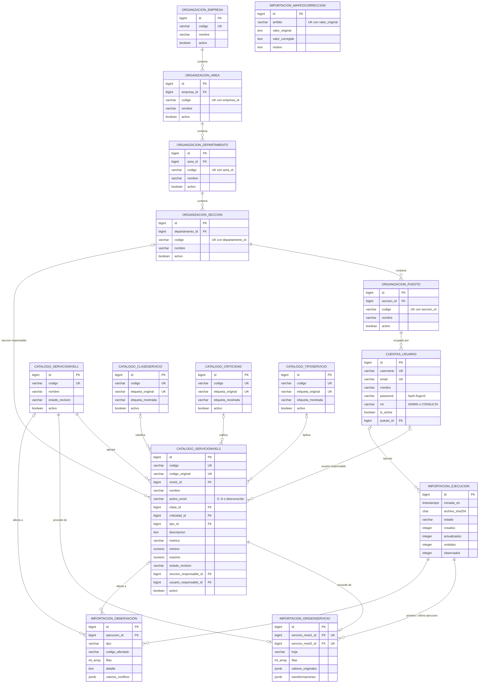

# Modelo de datos — propuesta v1 (fase 3)

> Documento de diseño previo a la implementación. Fuentes: `AGENTS.md` (§4, §5), `docs/contexto/enunciado.md`
> (§2, §3.2, §3.3, §3.4, §6) y `docs/contexto/analisis-excel.md` (hechos del Excel, SHA-256
> `de3b478a…dcf0`).
>
> - Las decisiones marcadas **PENDIENTE DE DECISIÓN DEL USUARIO** (sección 7) no están tomadas. Donde el modelo
>   depende de ellas, se indica con `→ Dn`.
> - Todo campo que no proviene del Excel ni del enunciado se marca **agregado por diseño**, con su motivo.
> - Motor: PostgreSQL 16. Framework: Django 5.2. Los nombres de tabla siguen la convención de Django
>   `<app>_<modelo>` (apps `cuentas`, `organizacion`, `catalogo`, `importacion`, según `AGENTS.md` §6).

---

## 1. Diagrama entidad-relación

Lectura de cardinalidades:

- Cada Área, Departamento, Sección, Puesto y Usuario tiene **exactamente un** padre (`||`); un padre tiene cero o
  muchos hijos (`o{`). Un puesto puede tener varios usuarios.
- Cada servicio nivel 2 tiene exactamente un nivel 1; clase, criticidad, tipo, sección responsable y usuario
  responsable son **cero o uno** (`|o`), porque las filas 99–101 no tienen atributos y los importados pueden quedar
  sin asignación.
- `IMPORTACION_ORIGENSERVICIO` pertenece a exactamente un servicio (nivel 1 **o** nivel 2); un servicio creado
  manualmente no tiene origen.
- `IMPORTACION_MAPEOCORRECCION` no tiene FK: es una tabla de reglas que el importador consulta por
  `(ambito, valor_original)`.
- No existe relación Usuario → Empresa: la empresa se deriva por
  `usuario.puesto.seccion.departamento.area.empresa` (`AGENTS.md` §4.9).

---

## 2. Convenciones comunes del diccionario

| Concepto | Implementación |
|---|---|
| PK | `id BIGINT GENERATED BY DEFAULT AS IDENTITY` (`BigAutoField` de Django) |
| FK | Restricción `FOREIGN KEY … DEFERRABLE INITIALLY DEFERRED` creada por Django, **sin** `ON DELETE` en la base (equivale a `NO ACTION`). En Django todas las FK usan `on_delete=PROTECT`: no hay borrado en cascada |
| Baja lógica | `activo BOOLEAN NOT NULL DEFAULT TRUE` (Usuario usa `is_active`, nombre requerido por Django). No se expone borrado físico en la interfaz |
| Texto obligatorio | `CHECK (btrim(col) <> '')` para que una cadena vacía o de espacios no cuente como valor |
| Auditoría | `creado_en TIMESTAMPTZ NOT NULL DEFAULT now()`, `actualizado_en TIMESTAMPTZ NOT NULL DEFAULT now()` (actualizado por Django con `auto_now`). **Agregado por diseño:** saber cuándo se dio de alta o modificó un registro; ayuda a P07 y P12 |
| Padre activo | No se puede expresar con CHECK (depende de otra fila). Se valida **en el servidor** (método `clean()` del modelo, invocado siempre mediante `full_clean()` en la capa de servicio) |
| Columnas abreviadas | Las columnas `creado_en`/`actualizado_en` se omiten en las tablas siguientes cuando solo repiten esta convención |

Abreviaturas: **N** = admite NULL; **NN** = NOT NULL; **UK** = UNIQUE.

---

## 3. Diccionario de datos

### 3.1 Organización (app `organizacion`)

#### `organizacion_empresa`

| Columna | Tipo PG | Nulo | Default | Clave | CHECK / nota |
|---|---|---|---|---|---|
| id | bigint identity | NN | identity | PK | |
| codigo | varchar(20) | NN | — | UK (global) | `btrim(codigo) <> ''` |
| nombre | varchar(200) | NN | — | | `btrim(nombre) <> ''` |
| activo | boolean | NN | `true` | | estado (baja lógica) |
| creado_en / actualizado_en | timestamptz | NN | `now()` | | agregado por diseño (ver §2) |

#### `organizacion_area`, `organizacion_departamento`, `organizacion_seccion`, `organizacion_puesto`

Las cuatro tablas tienen la misma forma; solo cambia la columna padre.

| Tabla | Columna padre (FK NN) | Referencia |
|---|---|---|
| `organizacion_area` | `empresa_id` | `organizacion_empresa(id)` |
| `organizacion_departamento` | `area_id` | `organizacion_area(id)` |
| `organizacion_seccion` | `departamento_id` | `organizacion_departamento(id)` |
| `organizacion_puesto` | `seccion_id` | `organizacion_seccion(id)` |

| Columna | Tipo PG | Nulo | Default | Clave | CHECK / nota |
|---|---|---|---|---|---|
| id | bigint identity | NN | identity | PK | |
| `<padre>_id` | bigint | **NN** | — | FK | NOT NULL impide huérfanos; FK impide padre inexistente |
| codigo | varchar(20) | NN | — | UK `(<padre>_id, codigo)` | `btrim(codigo) <> ''`. Nombre de restricción: `uq_<tabla>_padre_codigo` |
| nombre | varchar(200) | NN | — | | `btrim(nombre) <> ''` |
| activo | boolean | NN | `true` | | estado (baja lógica) |
| creado_en / actualizado_en | timestamptz | NN | `now()` | | agregado por diseño |

Validaciones en servidor (todas las tablas de organización):

- Alta o cambio de padre: el padre debe existir **y estar activo** (`AGENTS.md` §4.4).
- Desactivación con dependencias activas → **D1**.
- Reactivación: solo si el padre está activo (agregado por diseño: evita un hijo activo bajo un padre inactivo).

#### `cuentas_usuario` (usuario personalizado, `AUTH_USER_MODEL = "cuentas.Usuario"`)

Se basa en `AbstractBaseUser` (aporta `password` y `last_login`) y **no** en `AbstractUser`, para no tener
`is_staff`/`is_superuser` que puedan contradecir `rol` (ver supuesto S6).

| Columna | Tipo PG | Nulo | Default | Clave | CHECK / nota |
|---|---|---|---|---|---|
| id | bigint identity | NN | identity | PK | |
| username | varchar(150) | NN | — | UK sobre `lower(username)` | `btrim(username) <> ''`. Unicidad sin distinguir mayúsculas |
| email | varchar(254) | NN | — | UK sobre `lower(email)` | Inicio de sesión con usuario **o** correo |
| nombre | varchar(200) | NN | — | | `btrim(nombre) <> ''` |
| password | varchar(128) | NN | — | | Hash `argon2$argon2id$…` con sal (formato de Django). Nunca se muestra al rol consulta |
| rol | varchar(10) | NN | `'CONSULTA'` | | `CHECK (rol IN ('ADMIN','CONSULTA'))`. Default al de menor privilegio |
| is_active | boolean | NN | `true` | | Baja lógica; el backend de autenticación rechaza `is_active = false` |
| puesto_id | bigint | **NN** | — | FK → `organizacion_puesto(id)` | Sin huérfanos. Puesto activo: validado en servidor |
| last_login | timestamptz | N | NULL | | Aportado por Django |
| creado_en / actualizado_en | timestamptz | NN | `now()` | | agregado por diseño |

Tablas del framework que se usan sin modificar: `django_session` (el cierre de sesión borra la fila con
`logout()` → `session.flush()`), `django_migrations`, `django_content_type`, `auth_permission`.

### 3.2 Catálogos de atributos (app `catalogo`)

#### `catalogo_claseservicio`, `catalogo_criticidad`, `catalogo_tiposervicio`

Misma forma para las tres tablas.

| Columna | Tipo PG | Nulo | Default | Clave | CHECK / nota |
|---|---|---|---|---|---|
| id | bigint identity | NN | identity | PK | |
| codigo | varchar(30) | NN | — | UK | Identificador estable sin espacios (`A_DEMANDA`, `VERY_LOW`, `DEMOSTRATION`…). `CHECK (codigo ~ '^[A-Z0-9_]+$')` |
| etiqueta_original | varchar(100) | NN | — | UK | Texto exacto de la lista del Excel (p. ej. `Demostration`). No editable desde la interfaz |
| etiqueta_mostrada | varchar(100) | NN | — | | Texto que ve el usuario. Igual a la original salvo que exista un mapeo de corrección → **D7** |
| orden | smallint | NN | — | | **Agregado por diseño:** conservar el orden de la lista del Excel (filas 112–122); en criticidad expresa la escala Very Low → Very High. `CHECK (orden >= 0)` |
| fila_origen | integer | N | NULL | | **Agregado por diseño:** fila de la lista `E112:H122` de donde proviene; NULL si se creó en la aplicación |
| activo | boolean | NN | `true` | | Un valor inactivo no aparece en formularios nuevos |

Contenido esperado tras la importación (hecho del análisis §g): clase 2, criticidad 5, tipo 11.
La lista de `ACTIVO` (`S`, `N`, columna E) **no** es tabla: son dos valores fijos que se controlan con CHECK.

#### Registro del mapeo de correcciones: `importacion_mapeocorreccion`

Una sola tabla para todas las correcciones de textos y códigos procedentes del Excel. Las filas se cargan desde
una migración de datos versionada (reproducible y revisable en Git), no a mano.

| Columna | Tipo PG | Nulo | Default | Clave | CHECK / nota |
|---|---|---|---|---|---|
| id | bigint identity | NN | identity | PK | |
| ambito | varchar(30) | NN | — | UK `(ambito, valor_original)` | `CHECK (ambito IN ('ETIQUETA_CLASE','ETIQUETA_CRITICIDAD','ETIQUETA_TIPO','NOMBRE_N1','NOMBRE_N2','CODIGO_N2'))` |
| valor_original | text | NN | — | | Texto exacto del Excel |
| valor_corregido | text | NN | — | | `CHECK (valor_corregido <> valor_original)` |
| celda_origen | varchar(20) | N | NULL | | Celda de referencia, p. ej. `H113`, `D100` |
| motivo | text | NN | — | | Justificación de la corrección |
| activo | boolean | NN | `true` | | Permite retirar una regla sin borrarla |

Uso: el importador aplica las reglas activas, guarda el valor corregido en el campo funcional
(`etiqueta_mostrada`, `nombre` o `codigo`) y deja el original en `etiqueta_original`, `codigo_original` o
`valor_originales` del origen, y una entrada en `transformaciones`. Qué se corrige → **D7**; códigos → **D5**.

### 3.3 Servicios (app `catalogo`)

#### `catalogo_servicionivel1`

| Columna | Tipo PG | Nulo | Default | Clave | CHECK / nota |
|---|---|---|---|---|---|
| id | bigint identity | NN | identity | PK | |
| codigo | varchar(20) | NN | — | UK | Columna A, texto exacto (`SE.01` … `SE.12`). `btrim(codigo) <> ''` |
| nombre | varchar(200) | NN | — | | Columna B. Para SE.12 → **D3** |
| estado_revision | varchar(20) | NN | `'SIN_OBSERVACIONES'` | | **Agregado por diseño:** SE.12 tiene conflicto de nombre y debe quedar marcado. `CHECK (estado_revision IN ('SIN_OBSERVACIONES','PENDIENTE_REVISION','REVISADO'))` |
| activo | boolean | NN | `true` | | Estado del registro (baja lógica) |
| creado_en / actualizado_en | timestamptz | NN | `now()` | | agregado por diseño |

#### `catalogo_servicionivel2`

| Columna | Tipo PG | Nulo | Default | Clave | CHECK / nota |
|---|---|---|---|---|---|
| id | bigint identity | NN | identity | PK | |
| codigo | varchar(20) | NN | — | UK | Código funcional. Igual a `codigo_original` salvo normalización → **D5** |
| codigo_original | varchar(20) | N | NULL | UK parcial (`WHERE codigo_original IS NOT NULL`) | Columna C, texto exacto (`SE.12.1`). NULL solo en servicios creados en la aplicación. No editable. **Clave natural de importación** (§6) |
| nivel1_id | bigint | **NN** | — | FK → `catalogo_servicionivel1(id)` | Todo N2 pertenece a un N1. SE.12.3 → **D4** |
| nombre | varchar(200) | NN | — | | Columna D. `btrim(nombre) <> ''` |
| activo_excel | varchar(1) | N | NULL | | Columna E. `CHECK (activo_excel IN ('S','N'))`; NULL = desconocido (filas 99–101). Representación → **D6**; relación con `activo` → **D8** |
| clase_id | bigint | N | NULL | FK → `catalogo_claseservicio(id)` | Columna F. NULL = desconocido → **D6** |
| criticidad_id | bigint | N | NULL | FK → `catalogo_criticidad(id)` | Columna G |
| tipo_id | bigint | N | NULL | FK → `catalogo_tiposervicio(id)` | Columna H |
| descripcion | text | N | NULL | | Columna I. NULL si vacía (nunca `''`). I5 se guarda tal cual, como dato |
| metrica | varchar(200) | N | NULL | | Columna J |
| minimo | numeric(14,4) | N | NULL | | Columna K. Vacío → NULL, nunca 0 |
| maximo | numeric(14,4) | N | NULL | | Columna L. Vacío → NULL, nunca 0 |
| estado_revision | varchar(20) | NN | `'SIN_OBSERVACIONES'` | | `CHECK (estado_revision IN ('SIN_OBSERVACIONES','PENDIENTE_REVISION','REVISADO'))`. Filas 99–101 → `PENDIENTE_REVISION` |
| seccion_responsable_id | bigint | N | NULL | FK → `organizacion_seccion(id)` | Dato nuevo del parcial (no viene del Excel). Sección activa: servidor |
| usuario_responsable_id | bigint | N | NULL | FK → `cuentas_usuario(id)` | Opcional. Debe pertenecer a la sección responsable → **D9** |
| activo | boolean | NN | `true` | | Estado del registro (baja lógica) → **D8** |
| creado_en / actualizado_en | timestamptz | NN | `now()` | | agregado por diseño |

Restricciones de tabla:

| Nombre | Definición | Motivo |
|---|---|---|
| `ck_n2_minimo_le_maximo` | `CHECK (minimo IS NULL OR maximo IS NULL OR minimo <= maximo)` | Regla §4.6; P09. También se valida en el formulario para dar mensaje comprensible |
| `ck_n2_usuario_requiere_seccion` | `CHECK (usuario_responsable_id IS NULL OR seccion_responsable_id IS NOT NULL)` | No puede haber usuario responsable sin sección responsable |
| `uq_n2_codigo` | `UNIQUE (codigo)` | Código único en su entidad |
| `uq_n2_codigo_original` | `UNIQUE (codigo_original) WHERE codigo_original IS NOT NULL` | Idempotencia de la importación |

Índices adicionales (búsqueda y filtros, P10): `nombre` y `codigo` con `gin_trgm_ops` (extensión `pg_trgm`,
**agregado por diseño** para búsqueda parcial eficiente; opcional, con 46 registros basta `ILIKE`), y B-tree en
`nivel1_id`, `clase_id`, `criticidad_id`, `tipo_id`, `activo` (Django crea los de FK automáticamente).

### 3.4 Trazabilidad (app `importacion`)

#### `importacion_ejecucion`

Una fila por cada ejecución del importador (también las repetidas: así P07 es trazable).

| Columna | Tipo PG | Nulo | Default | Clave | CHECK / nota |
|---|---|---|---|---|---|
| id | bigint identity | NN | identity | PK | |
| iniciada_en | timestamptz | NN | `now()` | | Fecha de la ejecución |
| finalizada_en | timestamptz | N | NULL | | `CHECK (finalizada_en IS NULL OR finalizada_en >= iniciada_en)` |
| archivo_nombre | varchar(255) | NN | — | | p. ej. `data/CatalogoServicios.xlsx` |
| archivo_sha256 | char(64) | NN | — | | `CHECK (archivo_sha256 ~ '^[0-9a-f]{64}$')`. Permite comprobar que se importó el archivo original |
| hoja | varchar(100) | NN | `'Servicios Externos'` | | |
| estado | varchar(10) | NN | `'EN_CURSO'` | | `CHECK (estado IN ('EN_CURSO','EXITOSA','FALLIDA'))`. **Agregado por diseño:** distinguir una ejecución abortada |
| creados | integer | NN | `0` | | `CHECK (creados >= 0)` — registros nuevos (N1 + N2 + valores de catálogo) |
| actualizados | integer | NN | `0` | | `CHECK (actualizados >= 0)` — registros existentes con al menos un campo del Excel cambiado |
| sin_cambios | integer | NN | `0` | | **Agregado por diseño:** en una repetición, creados = actualizados = 0 y todo cae aquí; sin esta columna el resumen no cuadra |
| omitidos | integer | NN | `0` | | `CHECK (omitidos >= 0)` — filas de 5–101 que no generan registro (continuación, filas sin código) |
| observados | integer | NN | `0` | | `CHECK (observados >= 0)` — número de observaciones emitidas |
| total_n1 | integer | N | NULL | | **Agregado por diseño:** control de 12 códigos N1 encontrados |
| total_n2 | integer | N | NULL | | **Agregado por diseño:** control de 46 códigos N2 encontrados |
| detalle_conteos | jsonb | NN | `'{}'` | | **Agregado por diseño:** desglose por entidad `{"nivel1": {"creados": …}, "nivel2": {…}, "clase": {…}}` |
| ejecutada_por_id | bigint | N | NULL | FK → `cuentas_usuario(id)` | **Agregado por diseño:** NULL si se ejecutó por comando |
| mensaje_error | text | N | NULL | | Solo si `estado = 'FALLIDA'` |

#### `importacion_origenservicio`

Origen **vigente** de cada servicio importado (uno por servicio). El histórico por ejecución queda en
`importacion_ejecucion` + `importacion_observacion` + `primera/ultima_ejecucion`.

| Columna | Tipo PG | Nulo | Default | Clave | CHECK / nota |
|---|---|---|---|---|---|
| id | bigint identity | NN | identity | PK | |
| servicio_nivel1_id | bigint | N | NULL | FK, UK | |
| servicio_nivel2_id | bigint | N | NULL | FK, UK | `CHECK (num_nonnulls(servicio_nivel1_id, servicio_nivel2_id) = 1)` |
| hoja | varchar(100) | NN | — | | `Servicios Externos` |
| filas | integer[] | NN | — | | Filas físicas cubiertas, p. ej. `{5,6,7}` para SE.01.01; `{99,100}` para SE.12. `CHECK (cardinality(filas) >= 1)` |
| rangos_combinados | text[] | NN | `'{}'` | | p. ej. `{C5:C7,D5:D7,J5:J7}` |
| valores_originales | jsonb | NN | — | | Valor bruto por columna con su celda: `{"C": {"celda": "C5", "valor": "SE.01.01"}, "I": {"celda": "I5", "valor": "Revele su rollo "}, "K": {"celda": "K5", "valor": 1.0}, …}`. Para SE.12 guarda **ambos** nombres (B99 y B100) |
| transformaciones | jsonb | NN | `'[]'` | | Lista de transformaciones aplicadas: `[{"campo": "minimo", "regla": "vacio_a_null"}, {"campo": "nivel1", "regla": "padre_por_prefijo"}, …]` |
| primera_ejecucion_id | bigint | NN | — | FK → `importacion_ejecucion(id)` | |
| ultima_ejecucion_id | bigint | NN | — | FK → `importacion_ejecucion(id)` | |
| ultima_accion | varchar(12) | NN | — | | `CHECK (ultima_accion IN ('CREADO','ACTUALIZADO','SIN_CAMBIOS'))` |

#### `importacion_observacion`

| Columna | Tipo PG | Nulo | Default | Clave | CHECK / nota |
|---|---|---|---|---|---|
| id | bigint identity | NN | identity | PK | |
| ejecucion_id | bigint | NN | — | FK → `importacion_ejecucion(id)` | |
| tipo | varchar(40) | NN | — | | `CHECK (tipo IN ('CONFLICTO_NOMBRE_N1','FILA_SIN_CODIGO','PADRE_POR_PREFIJO','ATRIBUTOS_AUSENTES','CODIGO_FORMATO_NO_ESTANDAR','CORRECCION_APLICADA','TEXTO_CON_FORMA_DE_INSTRUCCION','ESPACIOS_EN_TEXTO','AUSENCIA_EN_CONTINUACION','CONTROL_CONTEO'))` |
| severidad | varchar(12) | NN | `'ADVERTENCIA'` | | **Agregado por diseño.** `CHECK (severidad IN ('INFO','ADVERTENCIA','ERROR'))` |
| codigo_afectado | varchar(20) | N | NULL | | Código tal como en el Excel; NULL en filas sin código (42, 67) |
| servicio_nivel1_id | bigint | N | NULL | FK | **Agregado por diseño:** mostrar observaciones en la ficha |
| servicio_nivel2_id | bigint | N | NULL | FK | Ídem |
| filas | integer[] | NN | — | | `CHECK (cardinality(filas) >= 1)` |
| celdas | text[] | NN | `'{}'` | | p. ej. `{B99,B100}` |
| detalle | text | NN | — | | Descripción legible |
| valores_conflicto | jsonb | N | NULL | | p. ej. `{"B99": "Suministrar Analitica", "B100": "Mantener Tableros de Control"}` |
| regla_aplicada | text | N | NULL | | **Agregado por diseño:** regla documentada que resolvió el caso (enunciado §3.4.6) |

Observaciones previstas con el Excel actual (sujetas a D2–D7): conflicto SE.12; filas 42 y 67 sin código;
SE.12.3 sin padre por celdas; atributos ausentes en 99–101; formato `SE.12.n`; I5 con forma de instrucción y
espacio final; ausencias de I/K/L en filas 6–7 de SE.01.01; correcciones aplicadas; resultado de controles 12/46.

---

## 4. Mapeo de columnas del Excel (hoja `Servicios Externos`, encabezados A4:L4)

| Col | Encabezado | Destino | Tratamiento |
|---|---|---|---|
| A | COD.N1 | `catalogo_servicionivel1.codigo`; FK `servicionivel2.nivel1_id` | Valor de la celda principal **dentro de su rango** `A…`. Texto exacto. Fila 101 vacía → D4 |
| B | SERVICIO - Nivel 1 | `servicionivel1.nombre` | Celda principal del rango `B…`. SE.12: dos valores (B99, B100) → D3, ambos en `valores_originales` + observación |
| C | COD.N2 | `servicionivel2.codigo_original` y `codigo` | Solo una celda C con valor propio (no continuación) crea un servicio. Texto exacto; normalización → D5 |
| D | SERVICIO - Nivel 2 | `servicionivel2.nombre` | Celda principal del rango `D…`. Errores de escritura → D7 |
| E | ACTIVO | `servicionivel2.activo_excel` | `S`/`N`; vacío → desconocido (D6). No modifica la baja lógica (D8). Fila principal del servicio |
| F | CLASE DE SERVICIO | `servicionivel2.clase_id` → `catalogo_claseservicio` (búsqueda por `etiqueta_original`) | Vacío → desconocido (D6). Lista `F112:F113` alimenta el catálogo |
| G | CRITICIDAD | `servicionivel2.criticidad_id` → `catalogo_criticidad` | Ídem; lista `G112:G116` |
| H | TIPO DE SERVICIO | `servicionivel2.tipo_id` → `catalogo_tiposervicio` | Ídem; lista `H112:H122` (incluye `Demostration`, D7) |
| I | Descripción | `servicionivel2.descripcion` | No combinada: valor de la fila principal. Vacío → NULL. I5 se conserva como dato y genera observación `TEXTO_CON_FORMA_DE_INSTRUCCION` |
| J | Métrica | `servicionivel2.metrica` | Celda principal del rango `J…` o de la fila principal |
| K | Minimo | `servicionivel2.minimo` | Número → `Decimal(str(valor))`; vacío → NULL (nunca 0). Texto no numérico → observación y NULL |
| L | Maximo | `servicionivel2.maximo` | Ídem. Si ambos existen y `minimo > maximo` → observación `ERROR` y el servicio no se guarda con esos valores |

Además, en todos los servicios: hoja, filas, rangos y valores brutos A–L → `importacion_origenservicio`.
Fuera de A–L: filas 1–2 (títulos) se ignoran; `E111:H111` (`OPCIONES`) y `E112:H122` alimentan catálogos, nunca
servicios.

---

## 5. Restricciones del enunciado → implementación

| Restricción (fuente) | Base de datos | Servidor (Django) | Prueba prevista |
|---|---|---|---|
| Código de Empresa único (§3.2) | `UNIQUE (codigo)` | `validate_unique` con mensaje | P05 |
| Código único dentro del padre (§3.2) | `UNIQUE (<padre>_id, codigo)` en Área/Depto/Sección/Puesto | Mensaje comprensible | P05 |
| Código N1 y N2 único (§3.3) | `UNIQUE (codigo)` en ambas tablas | Ídem | P05 |
| Un único padre, sin huérfanos (§3.2) | FK `NOT NULL` | Formularios con opciones controladas | P04, P05 |
| Referencia inexistente (§3.3, P05) | FK | `ModelChoiceField` rechaza id inexistente | P05 |
| Sin asociaciones nuevas con padres inactivos (§3.2) | — (no expresable con CHECK) | `clean()` verifica `padre.activo` / `puesto.activo` / `seccion.activo` | P04 (caso negativo) |
| Política de desactivación con dependencias (§3.2) | — | Servicio de desactivación → D1 | P04 (caso negativo) |
| Baja lógica, sin borrado silencioso (§3.2) | Columna `activo`/`is_active`; FK sin cascada | Sin vista de borrado; `PROTECT` | revisión + P04 |
| Empresa del usuario derivada (§3.2) | No existe columna `empresa_id` en usuario | Propiedad calculada `usuario.empresa` | P04 |
| Usuario o correo único (§3.2) | `UNIQUE (lower(username))`, `UNIQUE (lower(email))` | Backend que acepta usuario o correo | P01, P05 |
| Hash con sal, no reversible (§3.1) | `password varchar(128)` | `PASSWORD_HASHERS` con Argon2 primero | P01 + inspección del valor guardado |
| Usuario inactivo sin acceso (§3.1) | `is_active` | `ModelBackend.user_can_authenticate`; sesiones existentes dejan de ser válidas en la siguiente petición | P02 |
| Cierre de sesión invalida la sesión (§3.1) | `django_session` | `logout()` borra la sesión | P02 |
| Rol consulta solo lectura; sin hashes (§3.1) | `CHECK (rol IN …)` | Decorador/mixin por rol en cada vista de escritura; formularios/plantillas sin `password` | P03 |
| Opciones controladas de clase/criticidad/tipo (§3.3) | FK a tablas de catálogo | `ModelChoiceField` con `activo = true` | P05, P10 |
| `minimo <= maximo` (§3.3) | `ck_n2_minimo_le_maximo` | `clean()` del formulario/modelo | P09 |
| Ausente ≠ 0 (§3.3) | Columnas `NULL` sin default numérico | Importador: vacío → `None` | P08 |
| N2 pertenece a N1 (§3.3) | `nivel1_id NOT NULL` + FK | — | P06 |
| Responsable pertenece a la sección (§3.3) | `ck_n2_usuario_requiere_seccion` (parcial) | `clean()` + capa de servicio → D9 | P11 |
| Importados pueden quedar sin asignación (§3.3) | `seccion_responsable_id` NULL | — | P06 |
| ≥ 3 asignaciones demo (§3.3) | — | Comando de datos demo | verificación del comando |
| Conservar todos los campos del Excel (§3.3) | Columnas A–L (§4) + `valores_originales` | — | P06, P08 |
| Importación repetible sin duplicados (§3.4) | `UNIQUE` en claves naturales (§6) | `update_or_create` por clave natural en una transacción | P07 |
| Resumen creados/actualizados/omitidos/observados (§3.4) | `importacion_ejecucion` | Importador | P06, P07 |
| Celdas combinadas (§3.4.1) | `rangos_combinados`, `filas` | Lectura de rangos de openpyxl | P06 |
| SE.12 sin duplicar código (§3.4.2) | `UNIQUE (codigo)` en N1 | Regla D3 + observación | P08 |
| Códigos SE.12.n como texto (§3.4.3) | `varchar`, `codigo_original` | Lectura como `str`; D5 | P08 |
| Atributos incompletos 99–101 (§3.4.4) | FK/columnas NULL, `estado_revision` | Regla D6 | P08 |
| Filas de continuación y sin código (§3.4.5) | — | Clasificación por columna C; D2 | P06 |
| Trazabilidad (§3.4.6) | `importacion_origenservicio`, `importacion_observacion` | Importador | P06–P08 |
| Correcciones de etiquetas con mapeo (§2) | `etiqueta_original` + `importacion_mapeocorreccion` | Importador aplica reglas | P06 |
| 12 N1 y 46 N2 (§3.4) | — | Controles `total_n1`/`total_n2`; la ejecución falla si no coinciden | P06 |
| Persistencia (§5) | Volumen de PostgreSQL | — | P12 |

---

## 6. Clave natural para la importación idempotente

| Entidad | Clave natural | Garantía en BD | Comentario |
|---|---|---|---|
| Servicio nivel 1 | `codigo` = valor de A (texto exacto) | `UNIQUE (codigo)` | SE.12 aparece en dos filas pero es una sola clave → un solo registro |
| Servicio nivel 2 | `codigo_original` = valor de C (texto exacto, sin normalizar) | `UNIQUE (codigo_original) WHERE NOT NULL` | Se usa el original y no `codigo` para que la clave no dependa de D5 |
| Clase / criticidad / tipo | `etiqueta_original` (texto exacto de la lista) | `UNIQUE (etiqueta_original)` | No depende de D7 |
| Origen del servicio | FK al servicio | `UNIQUE` en cada FK | Se actualiza en cada ejecución |
| Mapeo de corrección | `(ambito, valor_original)` | `UNIQUE` | Cargado por migración de datos |
| Ejecución / observación | — (siempre se insertan) | — | Son el historial; repetir agrega una ejecución nueva, no registros funcionales |

Procedimiento: toda la ejecución en una transacción (`transaction.atomic`); por cada clave se busca el registro;
si no existe → `CREADO`; si existe y algún campo procedente del Excel difiere → `ACTUALIZADO` (con valor anterior y
nuevo en `transformaciones`); si no → `SIN_CAMBIOS`. Resultado esperado de una segunda ejecución sobre el mismo
archivo: `creados = 0`, `actualizados = 0`.

---

## 7. Decisiones pendientes

Cada una queda **PENDIENTE DE DECISIÓN DEL USUARIO**. La recomendación es solo una propuesta.

### D1. Desactivación de registros con dependencias activas — PENDIENTE DE DECISIÓN DEL USUARIO

Aplica a la jerarquía organizacional, a Sección con servicios asignados, a Usuario responsable de servicios, a
N1 con N2 activos y a valores de catálogo en uso.

| Opción | Ventajas | Desventajas |
|---|---|---|
| **A. Rechazar** si hay dependientes activos; el mensaje lista cuáles | Simple, explícito, nada cambia sin que el usuario lo vea; fácil de probar | Desactivar una rama completa exige ir de abajo hacia arriba |
| **B. Cascada con confirmación**: pantalla con el resumen de afectados; al confirmar se desactivan todos en una transacción y se registra el lote | Cómodo para ramas grandes; sigue sin borrar nada | Requiere tabla adicional de lotes de baja (agregado por diseño) para auditar y reactivar; más código y pruebas; decidir qué pasa con servicios asignados a una sección desactivada |
| **C. Permitir** desactivar el padre dejando hijos activos (solo se bloquean asociaciones nuevas) | Mínimo esfuerzo | Estado incoherente (hijos activos bajo padre inactivo); difícil de justificar ante "política coherente" |

Enunciado §3.2: "documentar e implementar una política coherente … sin eliminar información de manera silenciosa".
A y B lo cumplen. **Recomendación: A**, por ser la más fácil de verificar y explicar.

### D2. Filas 42 y 67 (con E–H, sin código N2, fuera de combinación) — PENDIENTE DE DECISIÓN DEL USUARIO

| Opción | Ventajas | Desventajas |
|---|---|---|
| **A. Omitir** como servicio; contar como omitidas y emitir observación `FILA_SIN_CODIGO` con sus valores E–H en `valores_conflicto` | Cumple "evitar asignarla automáticamente"; conserva los 46; los valores quedan como evidencia | Los valores de la fila solo viven en la observación (son idénticos a los del servicio anterior, así que no se pierde información funcional) |
| **B. Anexarlas** al servicio anterior (SE.06.05 / SE.09.01) como si continuaran su rango | Explica las filas | Contradice el enunciado §3.4.5 (asignación automática sin rango que la respalde) |
| **C. Crear un servicio N2** con código sintético | No pierde la fila | Inventa un código; rompe el control de 46 |

**Recomendación: A.**

### D3. Nombre canónico de SE.12 — PENDIENTE DE DECISIÓN DEL USUARIO

| Opción | Ventajas | Desventajas |
|---|---|---|
| **A. `Suministrar Analitica`** (B99) + ambos valores en `valores_originales` + observación `CONFLICTO_NOMBRE_N1` + `estado_revision = PENDIENTE_REVISION` | Es la primera aparición; no coincide con el nombre de ningún hijo; "Analítica" describe a los tres hijos (tableros y análisis) | Lleva el error de tilde (se combina con D7) |
| **B. `Mantener Tableros de Control`** (B100) | Es el último valor leído | Es idéntico al hijo SE.12.3 (D101): probable copia; describe solo a un hijo |
| **C. Mantener el código con nombre provisional** (p. ej. "SE.12 — nombre en revisión") | No toma partido | Inventa un nombre que no está en el Excel |

Enunciado §3.4.2 exige elegir y justificar, conservar ambos valores y emitir observación; las tres opciones guardan
evidencia, solo A y B usan un valor del archivo. **Recomendación: A.**

### D4. Padre de SE.12.3 (fila 101, A y B vacías, sin combinación) — PENDIENTE DE DECISIÓN DEL USUARIO

| Opción | Ventajas | Desventajas |
|---|---|---|
| **A. Por prefijo del código** (`SE.12.3` → `SE.12`), con observación `PADRE_POR_PREFIJO`, transformación registrada y `estado_revision = PENDIENTE_REVISION` | Regla explícita y verificable; cumple "todo N2 pertenece a un N1"; conserva 12/46 | Es una inferencia, no un dato de celda |
| **B. Por adyacencia** (heredar A de la fila anterior) | Mismo resultado aquí | Equivale a propagar valores fuera de un rango, lo que el enunciado §3.4.1 prohíbe sin regla explícita; generalizaría mal |
| **C. N1 comodín** ("SIN NIVEL 1") o no importarlo | No infiere | El comodín crea un 13.º N1 inexistente; no importarlo rompe los 46 |

**Recomendación: A** (aplicando la regla solo cuando A está vacía y el prefijo corresponde a un N1 existente).

### D5. Normalización de códigos `SE.12.1`–`SE.12.3` — PENDIENTE DE DECISIÓN DEL USUARIO

| Opción | Ventajas | Desventajas |
|---|---|---|
| **A. No normalizar**: `codigo = codigo_original = 'SE.12.1'`; observación `CODIGO_FORMATO_NO_ESTANDAR` | Máxima fidelidad; sin mapeo; lo que se busca es lo que dice el Excel | Formato mixto; orden alfabético puede no ser el natural en otros casos |
| **B. Normalizar** a `SE.12.01`…; `codigo_original` conserva el texto; tres filas `CODIGO_N2` en el mapeo | Formato uniforme `SE.NN.NN` | Dos códigos por servicio; la búsqueda debe cubrir ambos; más pruebas |
| **C. No normalizar + columna de orden** calculada | Fidelidad y orden natural | Columna adicional (agregado por diseño) para un problema que con 46 filas apenas existe |

Enunciado §3.4.3: conservar como texto; normalizar solo con original y mapeo verificable. **Recomendación: A.**

### D6. Representación de valores desconocidos (filas 99–101: E, F, G, H, J; y en general) — PENDIENTE DE DECISIÓN DEL USUARIO

| Opción | Ventajas | Desventajas |
|---|---|---|
| **A. NULL** en la columna/FK + `estado_revision = PENDIENTE_REVISION` + observación `ATRIBUTOS_AUSENTES`; la interfaz muestra "Sin dato en el Excel" y ofrece el filtro "sin valor" | No inventa valores; coherente con regla §4.7; NULL ya significa "desconocido" en SQL | Formularios y filtros deben tratar el caso NULL explícitamente |
| **B. Valor `DESCONOCIDO`** en cada catálogo y en `activo_excel` | FK siempre informada; filtros uniformes | Agrega a los catálogos un valor que no está en las listas del Excel; podría elegirse por error al crear servicios |
| **C. NULL + bandera booleana por campo** (`clase_desconocida`, …) | Explícito | Redundante con NULL; puede contradecirse |

Enunciado §3.4.4: "valores desconocidos o estado de revisión explícito; no inventar". **Recomendación: A.**

### D7. Qué errores de escritura se corrigen — PENDIENTE DE DECISIÓN DEL USUARIO

Candidatos: `Demostration` (H113), `Análsis` (D100), `Analitica` (B99), `Area 8`/`Area 9` (D50, D55), espacio
final en I5.

| Opción | Ventajas | Desventajas |
|---|---|---|
| **A. No corregir nada**; solo observaciones | Fidelidad total; mapeo vacío | La interfaz muestra errores |
| **B. Corregir solo etiquetas de catálogo** (`Demostration` → `Demonstration` en `etiqueta_mostrada`), registrada en el mapeo | Es exactamente el caso que menciona el enunciado §2; mínimo riesgo | Los nombres de servicios siguen con errores |
| **C. Corregir catálogo + nombres** (`Análisis`, `Analítica`, `Área 8/9`), todo en el mapeo con celda y motivo | Interfaz limpia | Más reglas; mayor riesgo de "corregir" algo que era intencional; las pruebas deben comprobar original y corregido |

En las tres opciones: I5 se guarda sin recortar (es dato y evidencia). **Recomendación: B.**

### D8. `ACTIVO` del Excel frente a la baja lógica del registro — PENDIENTE DE DECISIÓN DEL USUARIO

| Opción | Ventajas | Desventajas |
|---|---|---|
| **A. Dos campos independientes**: `activo_excel` (atributo de negocio S/N/desconocido, editable) y `activo` (baja lógica del registro). Todo importado entra con `activo = true`, incluso SE.05.01 (`N`) | No pierde información; el desconocido no se fuerza; el filtro "estado" puede ofrecer ambos | Dos conceptos de "activo": la interfaz debe rotularlos claramente ("Activo según catálogo" / "Registro dado de baja") |
| **B. Un solo campo**: `activo_excel` determina la baja lógica (`N` → inactivo) | Un solo concepto | No hay forma de mapear "desconocido" sin inventar; SE.05.01 quedaría oculto como si se hubiera borrado; mezcla dato importado con acción administrativa |
| **C. Estado único de tres valores** (`ACTIVO`, `INACTIVO`, `DESCONOCIDO`) que sirve para ambos | Un solo campo sin perder el desconocido | Una baja administrativa sobrescribe el valor original del Excel |

Enunciado §2: E es "indicador S/N; conservar desconocidos"; §3.3 pide "desactivar servicios" y filtrar por
estado. **Recomendación: A.**

### D9. Garantía de que el usuario responsable pertenece a la sección responsable — PENDIENTE DE DECISIÓN DEL USUARIO

| Opción | Ventajas | Desventajas |
|---|---|---|
| **A. Validación en servidor**: `ServicioNivel2.clean()` comprueba `usuario.puesto.seccion_id == seccion_responsable_id`, usuario activo y sección activa; toda escritura (formularios, importador, comando demo) pasa por una función de servicio que llama `full_clean()`. Se suma el CHECK `ck_n2_usuario_requiere_seccion` | Mensajes claros; fácil de probar (P11); sin lógica duplicada | Una escritura SQL directa podría saltarla |
| **B. A + trigger PostgreSQL** (`BEFORE INSERT OR UPDATE` en servicio N2 y `BEFORE UPDATE OF puesto_id` en usuario) | Garantía también ante SQL directo | Lógica repetida en `RunSQL`; errores de BD menos legibles; más mantenimiento |
| **C. FK compuesta**: columna `seccion_id` desnormalizada en usuario con FK `(puesto_id, seccion_id)` → puesto, y FK `(usuario_responsable_id, seccion_responsable_id)` → usuario | Garantía declarativa pura | Django 5.2 no soporta FK compuestas (requiere SQL manual); columna redundante que hay que mantener al mover puestos |

En cualquier opción falta definir qué pasa si el usuario cambia a un puesto de otra sección mientras es responsable;
propuesta coherente con D1-A: rechazar el cambio de puesto listando los servicios afectados.
**Recomendación: A** (B solo si queda tiempo).

---

## 8. Supuestos explícitos

| # | Supuesto | Consecuencia si no se cumple |
|---|---|---|
| S1 | Los códigos se comparan **exactamente** (sin mayúsculas/minúsculas ni recorte) para unicidad; los formularios solo recortan espacios iniciales/finales de lo que escribe el usuario | Si se quiere unicidad insensible a mayúsculas, cambiar a `UNIQUE (lower(codigo))` |
| S2 | Longitudes: códigos `varchar(20)` (el más largo del Excel tiene 8), nombres `varchar(200)` (el más largo ≈ 72) | Ampliar sin pérdida si aparece un dato mayor |
| S3 | `numeric(14,4)` basta para mínimo/máximo (Excel: 1, 100, 12, 24); los floats de openpyxl se convierten con `Decimal(str(v))` | Ajustar precisión |
| S4 | Usuario.puesto es obligatorio, también para las cuentas demo; el comando de cuentas demo crea una estructura organizacional mínima de demostración (dato nuevo, no del Excel) | Si se requiere un administrador sin puesto, `puesto_id` pasaría a NULL y habría que justificar la excepción |
| S5 | Se exige correo **y** nombre de usuario, ambos únicos; se puede iniciar sesión con cualquiera | Si solo se usa uno, se elimina el otro |
| S6 | No se usa el sitio de administración de Django ni `is_staff`/`is_superuser`; la autorización se basa solo en `rol` | Si se quiere `/admin/`, usar `AbstractUser` y sincronizar `is_staff` con `rol` |
| S7 | Al repetir la importación, el importador solo sobrescribe campos procedentes del Excel (A–L); **no** toca `seccion_responsable`, `usuario_responsable`, `activo` ni `estado_revision = 'REVISADO'` puesto por un administrador | Si se prefiere no sobrescribir ninguna edición manual, convertirlo en decisión |
| S8 | Una baja lógica hecha por un administrador no se revierte al reimportar | Ídem |
| S9 | Las reglas de mapeo se versionan como migración de datos, no se editan desde la interfaz | Si se quieren editar en la interfaz, añadir CRUD solo para administrador |
| S10 | Si los controles 12/46 no coinciden, la ejecución se marca `FALLIDA` y se revierte la transacción | Si se prefiere importar parcialmente, cambiar a observación `ERROR` |
| S11 | Los textos del Excel se guardan sin recortar (incluido I5 `'Revele su rollo '`) y se tratan solo como dato | — |
| S12 | El servicio nivel 1 no tiene atributos E–L propios; todos pertenecen al nivel 2 | — |
