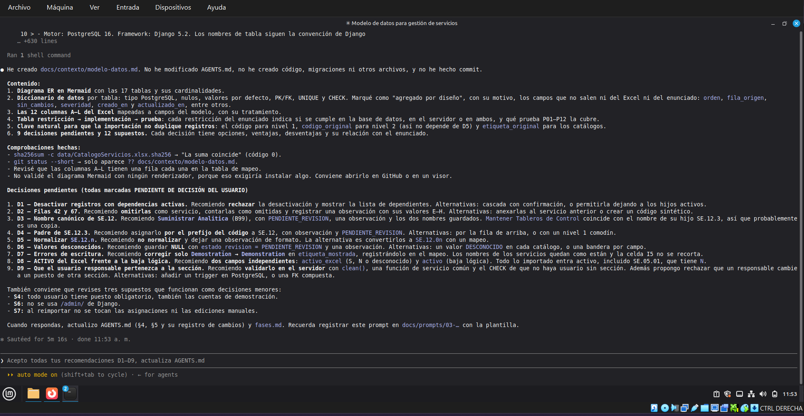

# Prompt 03: Diseño del modelo de datos

- **Herramienta:** Claude Code 2.1.287 (modo auto)
- **Modelo y versión:** Claude Opus 5.5 (cuenta Claude Pro)
- **Fecha de uso:** 2026-10-02
- **Fase:** Modelo de datos
- **Commit resultante:** `6f07d36`

## Objetivo
Diseñar el modelo de datos completo (ER, diccionario, mapeo Excel → BD) antes de escribir código, y obtener opciones fundamentadas para cada decisión pendiente sin que el asistente las tome por su cuenta.

## Contexto suministrado
- `AGENTS.md` (cargado automáticamente vía `CLAUDE.md`): reglas, límites y decisiones pendientes.
- `docs/contexto/enunciado.md` (secciones 2, 3 y 3.4): requisitos del modelo e importación.
- `docs/contexto/analisis-excel.md`: hechos verificados del Excel.

## Prompt utilizado
```
OBJETIVO
Diseñar el modelo de datos completo antes de escribir código y preparar opciones para las decisiones pendientes.

CONTEXTO
Lee AGENTS.md, docs/contexto/enunciado.md (secciones 2, 3 y 3.4) y docs/contexto/analisis-excel.md.

INSTRUCCIONES
Crea docs/contexto/modelo-datos.md con:
1. Diagrama entidad-relación en Mermaid (erDiagram) con todas las entidades y cardinalidades.
2. Diccionario de datos: por tabla, cada columna con tipo PostgreSQL, nulabilidad, default, PK/FK, UNIQUE y CHECK.
3. Entidades mínimas:
   - Organización: Empresa, Area, Departamento, Seccion, Puesto y Usuario (usuario personalizado de Django con rol ADMIN/CONSULTA, is_active y puesto FK). Unicidad (padre, codigo) en las subordinadas; código único global en Empresa. La empresa del usuario NO se guarda: se deriva.
   - Catálogos: ClaseServicio, Criticidad, TipoServicio (codigo, etiqueta_original, etiqueta_mostrada, activo) y la forma de registrar el mapeo de correcciones de etiquetas.
   - ServicioNivel1 (codigo único, nombre, estado) y ServicioNivel2 (codigo único, codigo_original, nivel1 FK, nombre, activo_excel, clase/criticidad/tipo FK nulables, descripcion, metrica, minimo y maximo DECIMAL nulables con CHECK minimo<=maximo cuando ambos existen, estado_revision, seccion_responsable FK nulable, usuario_responsable FK nulable, estado del registro).
   - Trazabilidad: origen de cada servicio (hoja, filas/rango, valores originales en JSONB), ejecución de importación (fecha, hash del archivo, conteos creados/actualizados/omitidos/observados) y observaciones de importación (tipo, código afectado, filas, detalle, valores en conflicto).
4. Mapeo de las 12 columnas del Excel (A–L) a campos del modelo.
5. Para CADA decisión marcada como "PENDIENTE DE DECISIÓN" en AGENTS.md, y además para la diferencia entre "ACTIVO" del Excel y la baja lógica del registro, y para cómo se garantiza que el usuario responsable pertenece a la sección responsable: presenta 2 o 3 opciones, ventajas y desventajas de cada una, relación con el enunciado y tu recomendación. NO decidas: deja cada una marcada como "PENDIENTE DE DECISIÓN DEL USUARIO".
6. Clave natural que se usará para que la importación sea idempotente.
7. Supuestos explícitos.

RESTRICCIONES
- Solo documentación: no crees código, migraciones ni otros archivos.
- No modifiques AGENTS.md todavía.
- No inventes campos fuera del Excel o del enunciado sin marcarlos como "agregado por diseño" con su motivo.
- No hagas commit.

SALIDA ESPERADA
docs/contexto/modelo-datos.md y, en tu respuesta, una lista numerada y breve de las decisiones pendientes con tu recomendación para cada una, para que yo responda.

CRITERIO DE ACEPTACIÓN
Las 12 columnas del Excel aparecen mapeadas; todas las restricciones del enunciado tienen una implementación indicada (base de datos o validación en servidor); cada decisión pendiente tiene opciones y recomendación sin estar decidida.
```

## Extracto de la salida
- `docs/contexto/modelo-datos.md`: diagrama ER en Mermaid con 17 tablas, diccionario de datos, mapeo de columnas A–L, tabla restricción → implementación → prueba.
- Campos agregados por diseño y justificados: `orden`, `fila_origen`, `sin_cambios`, `severidad`, `creado_en`, `actualizado_en`.
- Clave natural para idempotencia: código (nivel 1), `codigo_original` (nivel 2), `etiqueta_original` (catálogos).
- 9 decisiones pendientes (D1–D9) con opciones, ventajas, desventajas y recomendación, y 3 supuestos a revisar (S4, S6, S7).
- El asistente verificó el hash del Excel y que solo se creó el archivo pedido.

Captura: 



.

## ¿Cumplió el criterio de aceptación?
Sí. Las 12 columnas están mapeadas, cada restricción tiene implementación indicada y ninguna decisión fue tomada por el asistente.

## Problemas observados e iteración
- **Problema observado:** al terminar, Claude Code sugirió automáticamente la respuesta "Acepto todas tus recomendaciones D1–D9". No se usó: las decisiones se revisaron una por una y se ajustaron D7 (registrar observación para "Análsis") y D8 (filtrar por ACTIVO del Excel y por baja lógica). Ver Prompt 04.
- **Prompt revisado:** no fue necesario.
- **Resultado comprobado:**
