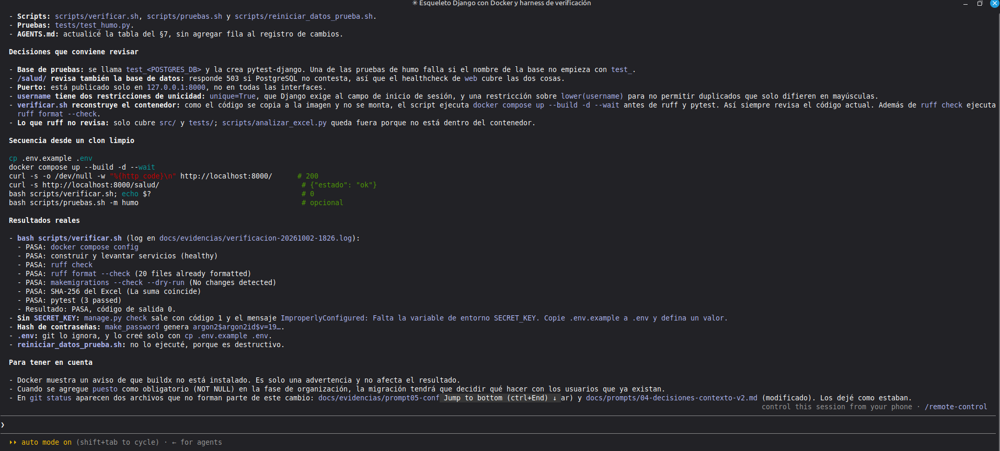

# Prompt 05: Scaffold, Docker y harness base

- Herramienta: Claude Code 2.1.287 (modo auto)
- Modelo: Claude Opus 5.5 (cuenta Claude Pro)
- Fecha de uso: 2026-10-02
- Fase: Scaffold y Docker / Harness engineering
- Commit resultante: `7ddcb3f`

## Objetivo
Crear el esqueleto del proyecto en Django, la configuración de Docker Compose y los scripts que permiten verificar el proyecto con un solo comando.

## Contexto suministrado
Antes de este prompt limpié la sesión con `/clear`. El asistente arrancó solo con `AGENTS.md` (cargado desde `CLAUDE.md`) y le indiqué leer `docs/contexto/modelo-datos.md`. Lo hice así para comprobar que el contexto versionado era suficiente y que no dependía del historial del chat.

## Prompt utilizado (5a)
```
OBJETIVO
Crear el esqueleto del proyecto Django, la configuración Docker y los scripts base del harness de verificación.

CONTEXTO
Lee AGENTS.md (ya cargado) y docs/contexto/modelo-datos.md (solo para conocer las apps y el usuario personalizado; todavía no implementes los modelos del dominio).

INSTRUCCIONES
1. Proyecto Django 5.2 en src/ (paquete de configuración: src/config/) con las apps: cuentas, organizacion, catalogo, importacion.
2. Usuario personalizado: cuentas.Usuario (hereda de AbstractUser) con el campo rol (ADMIN/CONSULTA) y AUTH_USER_MODEL configurado ANTES de la primera migración. El campo puesto se agregará en la fase de organización; no lo crees todavía.
3. Configuración leída de variables de entorno: DEBUG, SECRET_KEY, ALLOWED_HOSTS, POSTGRES_DB, POSTGRES_USER, POSTGRES_PASSWORD, POSTGRES_HOST, POSTGRES_PORT y las variables DEMO_ADMIN_* y DEMO_CONSULTA_* (solo declaradas en .env.example; se usarán después). Sin secretos por defecto en el código: si falta SECRET_KEY, la app debe fallar al arrancar con un mensaje claro.
4. PASSWORD_HASHERS con Argon2PasswordHasher primero. Idioma es-gt y zona horaria America/Guatemala.
5. requirements.txt con versiones fijadas (incluye pytest, pytest-django y ruff en el mismo archivo para poder probar dentro del contenedor).
6. Dockerfile: python:3.12-slim, usuario no root, dependencias instaladas en la imagen, código copiado desde src/.
7. compose.yaml:
   - db: postgres:16-alpine, volumen nombrado para los datos, healthcheck con pg_isready.
   - web: build local, env_file .env, depends_on db con condition: service_healthy, puerto 8000, healthcheck HTTP, y un entrypoint que espere la base, ejecute migrate y collectstatic y luego arranque gunicorn.
   - Monta en web, en solo lectura, data/ (para el importador futuro) y tests/ (para ejecutar pruebas).
8. .dockerignore, .gitignore (incluye .env, __pycache__, staticfiles) y .env.example con valores de demostración claramente marcados como tales.
9. Configuración de pytest (pytest.ini o pyproject.toml) y de ruff. Las pruebas deben usar la base de pruebas que crea pytest-django, nunca la base de evaluación.
10. Scripts en scripts/ (bash, con set -euo pipefail, usando docker compose exec):
   - verificar.sh: valida `docker compose config`, ejecuta ruff, `manage.py makemigrations --check --dry-run`, compara el SHA-256 del Excel con data/CatalogoServicios.xlsx.sha256 y ejecuta pytest. Imprime PASA/FALLA por paso, se detiene en el primer fallo con código distinto de 0 y guarda la salida en docs/evidencias/verificacion-AAAAMMDD-HHMM.log.
   - pruebas.sh: solo pytest con salida detallada, aceptando argumentos extra (por ejemplo -m p01).
   - reiniciar_datos_prueba.sh: el ÚNICO script que usa `docker compose down -v`; pide confirmación escribiendo "BORRAR" y advierte que se pierden los datos.
11. Página de inicio mínima en / que muestre "Catálogo de Servicios" y un endpoint /salud/ que responda 200 (para el healthcheck).
12. Una prueba de humo en tests/ que verifique / y /salud/.
13. Actualiza la tabla de comandos de AGENTS.md (§7) con los comandos que ahora existen, sin agregar fila al registro de cambios.

RESTRICCIONES
- Nada debe requerir instalar Python, Django o PostgreSQL en el anfitrión.
- No crees ni leas un .env real. Para probar, cópialo tú con `cp .env.example .env`; .env está en .gitignore.
- No uses `down -v` fuera de reiniciar_datos_prueba.sh.
- No hagas commit.

SALIDA ESPERADA
Los archivos anteriores, la secuencia exacta de comandos para probar desde un clon limpio y la salida real de la verificación.

CRITERIO DE ACEPTACIÓN
Con `cp .env.example .env && docker compose up --build -d` ambos servicios quedan sanos (healthy), http://localhost:8000/ responde, y `bash scripts/verificar.sh` termina con código 0.
```

## Iteración 1: conflicto entre el prompt y el contexto
Problema observado: en mi prompt pedí que el usuario heredara de `AbstractUser`, pero en el modelo de datos v2 yo había aceptado el supuesto S6, que define `AbstractBaseUser` sin `is_staff` ni `is_superuser` y con la autorización basada solo en el rol. El asistente no siguió el prompt a ciegas: detectó la contradicción y me preguntó cuál usar.

Prompt revisado: le indiqué usar `AbstractBaseUser` (opción 1), para ser coherente con S6 y no tener que mantener `is_staff` sincronizado con el rol.

Resultado comprobado: la migración `cuentas.0001_initial` creó el usuario con `username`, `email`, `nombre`, `rol` e `is_active`, con restricciones de unicidad sin distinguir mayúsculas. Captura: 


.

Lo que aprendí: el prompt tenía un error mío y el contexto versionado sirvió para detectarlo.

## Incidente durante la ejecución
Mientras el asistente levantaba los servicios, la computadora se suspendió y la máquina virtual perdió el DNS. El comando `docker compose up --wait` quedó esperando más de 5 horas. Al revisar los logs vi que la aplicación sí había arrancado bien. Reinicié `systemd-resolved` y `NetworkManager`, y el asistente continuó solo.

## Extracto de la salida
- Proyecto Django 5.2 en `src/` con las apps `cuentas`, `organizacion`, `catalogo` e `importacion`.
- `Dockerfile` con usuario no root, `compose.yaml` con PostgreSQL 16, volumen, healthchecks y espera de la base.
- Contraseñas con Argon2. Si falta `SECRET_KEY`, la app no arranca y muestra un mensaje claro.
- Scripts `verificar.sh`, `pruebas.sh` y `reiniciar_datos_prueba.sh` (el único con `down -v`, con confirmación).
- Pruebas de humo para `/` y `/salud/`. Las pruebas usan una base aparte que empieza con `test_`.
- El puerto queda publicado solo en `127.0.0.1:8000`.

Captura: 



.

## Seguimiento 5b: ciclo de harness con un fallo real
Al revisar los logs del contenedor vi `[ERROR] Control server error: Permission denied: '/home/app'`. `verificar.sh` no lo había detectado porque no revisaba los logs. Le pedí al asistente agregar ese control, ejecutarlo antes de corregir, corregir la causa y volver a ejecutar.

```
TAREA (ciclo de harness con un fallo real)
En los logs del contenedor web aparece: "[ERROR] Control server error: [Errno 13] Permission denied: '/home/app'". scripts/verificar.sh no lo detectó porque no revisa los logs.

INSTRUCCIONES
1. Agrega a scripts/verificar.sh, después de levantar los servicios, un paso "logs de web sin errores" que revise los logs de web desde el último arranque del contenedor y falle si encuentra líneas con "[ERROR]", "Traceback" o "CRITICAL". Debe mostrar las líneas encontradas.
2. Ejecuta `bash scripts/verificar.sh` SIN corregir todavía la causa. Debe fallar en ese paso. Copia ese log a docs/evidencias/ciclo-harness/01-fallo.log.
3. Explica la causa raíz del error de gunicorn y corrígela en el Dockerfile o en la configuración (sin desactivar el control ni ocultar el mensaje).
4. Vuelve a ejecutar `bash scripts/verificar.sh` hasta que termine con código 0. Copia ese log a docs/evidencias/ciclo-harness/02-exito.log.
5. Crea docs/evidencias/ciclo-harness/README.md con la secuencia: tarea, cambio, control ejecutado, fallo detectado, causa, corrección, nueva ejecución satisfactoria. Indica que el fallo NO fue introducido deliberadamente: apareció en los logs del scaffold. Redáctalo en primera persona del plural, sin guiones largos.

RESTRICCIONES
- No uses `down -v`. No hagas commit.
- No modifiques el control para que deje pasar el error.

SALIDA ESPERADA
Los dos logs, el README del ciclo y un resumen corto.
```

Resultado: el control nuevo falló como esperaba. La causa era que el Dockerfile creaba el usuario `app` con `--no-create-home` y gunicorn no podía crear su socket de control. Se cambió a `--create-home` y la verificación volvió a terminar con código 0. En el proceso el asistente encontró otro problema en el script: dos ejecuciones en el mismo minuto se mezclaban en el mismo log. Lo corrigió agregando un sufijo al nombre. El fallo no fue introducido a propósito.

Detalle completo: `../evidencias/ciclo-harness/README.md`, `01-fallo.log` y `02-exito.log`. Capturas: 


 y 


.

## ¿Cumplió el criterio de aceptación?
Sí. Lo comprobé yo misma ejecutando `bash scripts/verificar.sh`: los 8 pasos en PASA, 3 pruebas aprobadas y código de salida 0. El log está en `docs/evidencias/verificacion-20261002-1902.log`.
