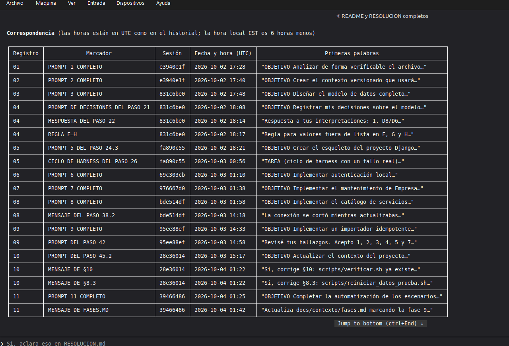
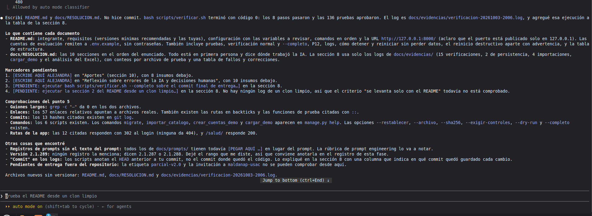

# Prompt 12: README y RESOLUCION.md

- Herramienta: Claude Code 2.1.289 (modo auto)
- Modelo: Claude Opus 5.5 (cuenta Claude Pro)
- Fecha de uso: 2026-10-03
- Fase: Documentación
- Commit resultante: `7b37fac`

## Objetivo
Escribir `README.md` y `docs/RESOLUCION.md` basados solo en lo que existe en el repositorio, con reglas de estilo para que el texto quede en primera persona y sin guiones largos.

## Contexto suministrado
Sesión nueva después de actualizar Claude Code. Le indiqué leer todo `docs/contexto/`, los registros de `docs/prompts/`, las evidencias y el historial de commits. Le di mis datos, el entorno donde probé y le pedí dejar marcadores para mis aportes y mi reflexión.

## Prompt utilizado (12a)
```
OBJETIVO
Escribir README.md y docs/RESOLUCION.md completos, verificables y basados solo en lo que existe en el repositorio.

CONTEXTO
Lee AGENTS.md (ya cargado), docs/contexto/ completo (enunciado.md secciones 5, 7, 8 y 10; modelo-datos.md; mapeo-excel.md; seguridad.md; matriz-pruebas.md; fases.md), todos los registros de docs/prompts/, docs/evidencias/ (incluido ciclo-harness/README.md) y el historial con `git log --oneline`.

ESTILO DE REDACCIÓN (obligatorio)
- Escribe en primera persona del singular, como si lo redactara yo, la estudiante: "decidí", "revisé", "noté que".
- No uses guiones largos (—) en ningún lugar; usa punto, coma o dos puntos.
- Tono natural y directo, sin frases de relleno ni adjetivos exagerados. Pocas negritas.
- Donde el trabajo lo hizo el asistente de IA, dilo claramente; no ocultes el uso de IA.

DATOS
- Integrante: Aída Alejandra Mansilla Orantes, carné 202100239.
- Entorno donde lo probé: Linux Mint 22.3 en VirtualBox, Docker 29.1.3, Docker Compose 2.40.3, Git 2.43.
- Asistente: Claude Code (versiones 2.1.287 a 2.1.289, según cada registro) con el modelo Claude Opus 5.5 en una cuenta Claude Pro.
- Repositorio: https://github.com/aidaorantes9/parcial-catalogo-servicios-202100239 (rama main).

INSTRUCCIONES
1. README.md, que permita levantar y probar todo desde un clon limpio:
   integrante; requisitos (versiones mínimas razonables de Docker y Compose v2 y las versiones con que se probó); configuración (`cp .env.example .env` y qué variables revisar); comandos exactos en orden (levantar, importar, crear cuentas demo, cargar demo, abrir la app, pruebas, verificación normal y completa, persistencia); URL y puerto (aclara que el puerto está publicado solo en 127.0.0.1); cómo entrar con las cuentas de evaluación (sin escribir contraseñas, remitiendo a .env.example); logs, detener, reiniciar sin perder datos y, separado y con advertencia, el reinicio destructivo; tabla breve de la estructura del repositorio; enlace a docs/RESOLUCION.md.
2. docs/RESOLUCION.md con las 10 secciones de la sección 8 del enunciado, en ese orden:
   1) problema, alcance y supuestos; 2) arquitectura y justificación de tecnologías; 3) diagrama ER en Mermaid y diccionario de datos (resumido, remitiendo a modelo-datos.md para el detalle); 4) mapeo Excel → base de datos, combinaciones, conflictos, ausencias y un extracto real del reporte de importación (remite a mapeo-excel.md y al log); 5) autenticación, autorización, contraseñas y sesión (remite a seguridad.md); 6) evidencias separadas de context engineering, prompt engineering y harness engineering, con enlaces a archivos y hashes de commit reales (versiones v1, v2 y v3 del contexto; los 11 prompts registrados con su objetivo; las dos iteraciones: prompt 05 por el conflicto AbstractUser/AbstractBaseUser y prompt 09 por las referencias inactivas y el hash con --archivo; el ciclo de harness del error de gunicorn); 7) matriz requisito → implementación → prueba → evidencia que cubra los requisitos de las secciones 3.1 a 3.4 y 5 del enunciado; 8) resultados reales de pruebas con comando, fecha, commit y resultado, tomados de los logs de docs/evidencias, y los fallos encontrados con su corrección; 9) Docker, persistencia y recuperación del entorno; 10) limitaciones conocidas, aportes y reflexión.
3. En la sección 8, usa SOLO resultados que estén en docs/evidencias/. Si algo no tiene log, escribe "[PENDIENTE: ejecutar …]". No inventes fechas, commits ni números.
4. En la sección 10: escribe tú las limitaciones conocidas (por ejemplo: no hay pruebas con navegador real, P12 se apoya en la base de evaluación, el servicio de prueba T1 en mi entorno local). Para los aportes y la reflexión, NO los redactes: deja los encabezados "Aportes" y "Reflexión sobre errores de la IA y decisiones humanas" con el marcador [ESCRIBE AQUÍ ALEJANDRA] y, debajo de cada uno, una lista de insumos con hechos del repositorio que yo pueda usar (errores o propuestas de la IA que corregí, sugerencias automáticas que no acepté, decisiones que tomé).
5. Comprueba que cada comando del README existe en scripts/ o en manage.py, que cada enlace a archivo apunta a un archivo real y que cada hash de commit citado existe en `git log`.

RESTRICCIONES
- No incluyas conversaciones completas, contraseñas ni contenido de .env.
- No afirmes nada que no esté respaldado por un archivo o un commit.
- No hagas commit.

SALIDA ESPERADA
README.md y docs/RESOLUCION.md, más una lista de los marcadores pendientes y el resultado de las comprobaciones del punto 5.

CRITERIO DE ACEPTACIÓN
Un clon limpio se puede levantar y probar siguiendo solo el README; RESOLUCION.md tiene las 10 secciones; no hay guiones largos (`grep -c "—" README.md docs/RESOLUCION.md` da 0); todos los enlaces y hashes existen.
```

## Hallazgo: registros de prompts sin el texto
Al revisar el repositorio, el asistente encontró que todos los registros de `docs/prompts/` todavía tenían el marcador para pegar el prompt en lugar del texto. Fue un error mío: preparé cada registro pero nunca pegué los prompts. Le pedí que los recuperara del historial de sesiones de Claude Code, leyendo solo mis mensajes:
```
Corrige los registros de docs/prompts/: cada marcador [PEGAR AQUÍ …] debe reemplazarse por el texto EXACTO que yo envié en ese momento.

INSTRUCCIONES
1. Busca los mensajes que yo escribí en el historial de sesiones de Claude Code de este proyecto (los archivos .jsonl en ~/.claude/projects/ que correspondan a /home/alejandra/parcial-catalogo-servicios-202100239). Solo lee mis mensajes de usuario; no copies respuestas del asistente ni resultados de herramientas.
2. Para cada marcador, identifica el mensaje correspondiente según la descripción del marcador (por ejemplo "EL PROMPT 1 COMPLETO", "EL MENSAJE DEL PASO 38.2", "LA REGLA F–H", "EL MENSAJE DE §10") y el contenido del registro. Pega el texto tal cual, sin corregirlo ni resumirlo, dentro del bloque de código que ya existe.
3. Si para algún marcador no encuentras el mensaje con seguridad, no lo inventes: déjalo como está y avísame cuál es.
4. No cambies nada más de los registros.
5. Al final ejecuta y muéstrame:
   grep -rn "PEGAR AQUÍ" docs/prompts/
   grep -c "—" docs/prompts/*.md
   y una tabla con cada registro, cada marcador reemplazado y de qué sesión salió (fecha y primeras palabras del mensaje).

RESTRICCIONES
Solo lee el historial para extraer mis mensajes; no lo copies al repositorio. No hagas commit.
```
Reemplazó los 19 marcadores con el texto exacto que envié, e indicó para cada uno la sesión, la fecha y la hora en que lo escribí. El historial no se copió al repositorio. Captura de la tabla de correspondencia: 



.

## Seguimiento: aclaración de los hallazgos del importador
```
Sí, aclara en RESOLUCION.md que de los 8 hallazgos del importador acepté 6 y corregí 2 (el 6, referencias inactivas, y el 8, hash con --archivo), y que esa corrección es la iteración 2 del prompt 09. Solo ese cambio. Luego muéstrame la salida de:
grep -rn "PEGAR AQUÍ" docs/prompts/
grep -c "—" README.md docs/RESOLUCION.md docs/prompts/*.md
No hagas commit.
```

## Extracto de la salida
- `README.md` con requisitos, configuración, comandos en orden, URL, cuentas de evaluación (sin contraseñas), pruebas, logs, apagado, reinicio y reinicio destructivo aparte.
- `docs/RESOLUCION.md` con las 10 secciones del enunciado, en primera persona y con enlaces a archivos y commits.
- El asistente comprobó que los 57 enlaces, los 13 hashes de commit, los 6 scripts y los comandos de `manage.py` existen, y que no hay guiones largos.
- La sección 8 usa solo resultados que están en `docs/evidencias/`.

Los aportes y la reflexión de la sección 10 los escribí yo y reemplacé los marcadores. Borré las listas de apoyo que había dejado el asistente.

Captura: 



.

## ¿Cumplió el criterio de aceptación?
Sí en lo que se puede comprobar dentro del repositorio: 10 secciones, cero guiones largos y enlaces y hashes válidos. La comprobación de levantar todo desde un clon limpio la hice después, por separado.

## Problemas observados e iteración
No hizo falta revisar el prompt. El problema importante fue mío (los registros sin prompts) y lo detectó el asistente al revisar el repositorio.
